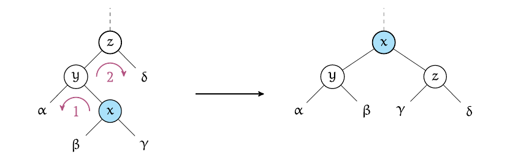

# Splay-дерево

```python
def splay_find(x):
    ///find из обычного дерева
    u = find(x)
    splay(u)
    return u

def splay_insert(x):
    u = insert(x)
    splay(u)
    return u

def splay_ins(x):
    u = insert(x)
    splay(u)
    return u

//все ключи T1 < T2
def splay_merge(T1, T2):
    u = find_min(T2)
    u.left = T1
    return u

def splay_remove(v):
    T1, v, T2 = splay_split(v)
    return splay_merge(T1, T2)
    
```
#### Наблюдение
1. splay(v) = O(h) -- не больше h поворотов, каждый зв единицу
2. все операции = $\O(h)$ -- это splay + что-то еще

Путь есть последовательность операций, c_i - истинная стоимость i-той операции. Всего m >= n операций. 

* Заведем функцию F от структуры дерева : F(T). Перед первой операцией F_0 = 0, после каждой операции пересчитываем $c'_i=c_i + F_i - F_{i-1}$
* c' - учетная стоимость i-той операции
* $F_i$ - значение функции от нашей структуры после i-той операции ($T_i$).

* Цель: доказать, что $\sum c_i = O(mlogn)$
* Как это нам поможет? $\sum_{i=1}^m c'_i = \sum_{i=1}^m c_i + F_i = \sum_{i=1}^m c_i + F_m + F_0$ - сумма F телескопическая (все кроме 1 и последнего сокращаеся)

Если выполняются хорошие свойства на концы интервалов и c':
1. $F_i = O(nlogn)$
2. $c'_i = O(logn)$

Тогда сумма $c_i = m*O(logn) + O(nlogn) = O(mlogn)$

**Теорема**: 
1. существует такая функция от деревьев F(T), что хорошие свойства 1, 2 выполняются
2. учётная стоимость операции splay = $\O(logn)$. То же для find (т.к. он не меняет структуру дерева)
> ниже требуем, чтобы Учетная стоимость всех остальных операций отличаются от splay не больше, чем на logn (т.е. на стоимость splay)
3. добавление листа меняет F(T) не более, чем на logn
4. $T = merge(T1, T2) => F(T) <= F(T1) + F(T2) + \O(logn)$
5. $T1, T2 = split(T, k)$  
$F(T1) + F(T2) <= F(T) + \O(logn)$

**Доказательство**
 * w(x) - вес вершины x, равен числу вершин в ее поддереве. $F(x) = log_2(w(x))$ 
 > $F(x) = log_2(w(x))$ -- что-то вроде миинмальной высоты листа
 * Тогда $F(T) = \sum_{x\in T}F(x)$
 ## **Доказательство 1**
 * $F(x) = log w(x) <= logn$ - для 1 узла
 * $F(T) <= nlogn$ - для всего дерева 
 ## **Доказательство 4**
 ? сплей норм и мерж через него нормэ
 ## **Доказательство 3**
* $F = c' - split < logn$. Почему? потенциал от дерева - сумма потенциалов по вершинам. Потенциал для вершины - логарифм от числа детей.
* У каких вершин изменилась функция? у тех, что были на пути от корня до нашей. Почему во всем поддереве это выросло не больше, чем на логарифм? 
* На самом деле нам интересен логарифм. Пусть цена измнеилась, ь.к. прошел переход k -> k+1 => Tu -> Tu +1. то есть раньше логарифм округлялся в k, а теперь в k+1. Значит число детей стало ровно $2^{k+1},$ а было $2^k$. У всех изменившихся вершин это k должно быть разным (т.ек. проходим только по 1 пути до корня, по определению w(x) строго увеличивается). Сколько таких вершин может быть? не больше, чем logn (даже для вырожденного дерева)

## **Доказательство 4**
'~~~ как в доказательстве 3

## **Доказательство 2**: splay
Имеем 3 возможных варианта (и симметричные к ним)
1. zigzag: вершина - левый ребенок и правый внук.

2. zigzig: левый ребенок, левый внук. без этого шага амортизированная оценка не получится (в среднем не будет равномерно сбалансированное)

3. zig: левый сын (одно малое вращение)


### Доказательство: учетная стоимость
1,2. zigzag или zigzig <= 3(F'(x) - F(x))  
3. zig <= 3(F'(x) - F(x))  + 1
> Теорема 2 (весь splay - последовательноть 1 или 2, в итоге все F кроме первого и последнего сократятся (+1 из 3-го шага)). Нам известно, что каждая из F <= logn (по определению) => и splay = O(logn):  
> $c'_i <= 3 Flast - 3Ffirst + 1 <= 6 logn + 1 => theorema 2$

Доказательство 3 (zig):  
$c'_i = c_i + F'(T) - F(T) c_i = 1$ (один поворот), 
* F'(T) - потениал исходного дерева, F от A, B, Г не изменился (их нужно учитывать в Ф, то они не меняются )
*  $c'_i = 1 + F'(x) + F'(y) - F(x)-F(y)$, F'(y) <= F'(x), F(x) <= F(y), неравенство нестрогое, т.к. и потенциал не строго растет (там же логарифм!!)
*  $c'_i <= 1 + 2(F'(x) - F'(x))$
* x - корень, F(x) > F'(x) (их разность не отрицательна)=> $c'_i <= 1 + 3(F'(x) - F'(x))$

Доказательство 3 (zigzig):  
* константа d - число элементарных операций для 2х поворотов (переставить ссылки, поменять ребенка и тд). все считаем в числе больших поворотов, вместо чиста обычных операций (например, у нас супер пк, который делает d итераций за раз)
* для удобства заменим $F = d(log_2wx)$, теперь можем прибавлять 1 вместо d
* $c' = c + F'(T) - F(T) = F'(x) + F'(y) + F'(z) - F'(x) - F'(y) - F'(z) + 1$ (*)
* Наблюдение 1: F'(x) = F(z) -- оба корни, число элементов не меняем
* Рассмотрим несколько вариантов 

* * Вариант а : F'(x) > F(x)  
F(x) <= F(y) <= F(z)   
F'(z) <= F'(y) <= F'(x)      
(*) <= 3(F'(x) - F(x)) , 1 <= F'(x) - F(x)

* * Вариант b : F'(x) = F(x)  
Пусть F'(z) < F'(x) (т.е. они не равны), докажем:  
1 + F'(z) + F'(y) - F(x) - F(y) = <1 + F'(z) это не больше F'(x), т.к. отличаются на целое число(т.е. как минимум на единицу) > <= 2(F'(x) - F(x)) = 0

* * Вариант с : все F и F' для x, y, z равны s  
=> $w'(x) < 2^{s+1}$ = 3 + w'(A) + w'(В) + w'(Г) + w'(Д) = (w'(A) + w'(В) + 1 ) + (w'(Г) + w'(Д) + 1) + 1  >= 2*2^{s} + 1 => противоречие на w'
