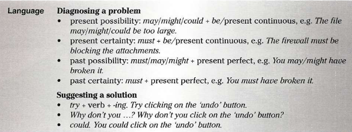

 
 what kind of problems you usually have?

My usual problem is that Adding new functionality in program code can destroy previous functionality (фанкшаналити).

* I am including an unit testing module in my programm  that help detect these errors and help fix them

brocken
burnt 
cracked - трещина
crushed
split - разошедшаяся трещина, отколот
torn - порван
twisted
dented - помят
scratch - царапать
