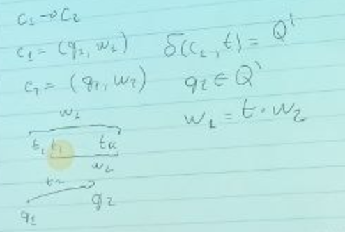

# Система переписывания строк (слов)
## Машина Маркова / Тьюринга
* фиксируем алфавит $\Sigma$ 
* имеем лентны над символами
* задаем правила подстановки w' -> w'', множество таких правил p
* в общем виде порядок подстанвоок не определен (если найдено несколько, какую применять первой? может быть несколько правил для одной строки)

### Система ограничений
$$G = <\Sigma, N, S, P>$$
* G - контекстно свободная грамматика (слева в правиле вывода только 1 нетерминальный символ)
* Σ - терминальный алфавит (для него нет правил вывода)
* N - нетерминальный алфавит
* Σ' = Σ and N (их пересечение пусто)
* S - начальное состояние ($\in N$, это просто мы решили такое ограничение задать для нашей системы)
* P - набор правил - множество правил: p = {p | n -> w' n $\in$ N, w'}

Останавливаемся, когда не можем применить ни одно из правил. Но есть 3 варианта результата

s -> ... -> w
1. w = $\epsilon$ - строка пустая w $\in \Sigma^*$ - терминальный алфавит, в котором разрешена пустая строка, $R^0 = \epsilon$
2. w $\in \Sigma$, т.е. все символы терминальные 
3. $\exists i: w[i] \in N$ если есть такое - считаем, что язык не очень хороший

$L_g $ - язык, заданный кс-грамматикой $L_g = S ~~->^*~~ w, w \in \Sigma^*$

* умножение над множествами 
$$R_1 * R_2 = {w = w_1 * w_2 | w_1 \in R_1, w_2 \in R_2}$$
$w_1 * w_2 - $ операция, определенная на домене (у нас конкатенация строк)
$$R^n = R*R...$$
$$R^* = R^0 ~and~ R^1~ and~...$$ 
$R^*$ -  замыкание над ...

### Примеры кс-грамматики
#### Пример 1
* $\Epsilon = \{a, b\}$
* $\N = \{S, M\}$
* S = S
* P = {
0. S -> ab
1. S -> aSb
2. \* *S -> aXb* (такие примеры не очень хорошие, но существенно для решения задач не мешает)  
}
> S -> (0) **ab** $\in L_G$   
 S -> (1) aSb ->(2) **aaXbb** $\notin L_G$ 
 #### Пример 2
* $\Sigma = \{a, b, c, d\}$
* $\N = \{S, S_1, S_2\}$
* S = S
* P = {
0. S -> ϵ
1. S -> $SS_1$
2. S -> $SS_2$
3. $S_1$ -> $S$
4. $S_2$ -> $S$
5. $S_1$ -> $aS_1b$
6. $S_2$ -> $cS_2d$  
}
> S -> (0) ϵ   
> S -> (1) $SS_1~$ ->(3) SS -> (2) $SS_2S~$ ->(1) $SS_2S1~$ ->(6) $ScS_2bS_1~$ ->()... 

Мы описали процесс **генерации**.   
Получилась недетерминированная машина: загружаем в нее грамматику, дергаем на ручку, она выполняет недетерминированный процесс и выплевывает слово, которое задается нашей грамматикой.  
Машину можно **зациклить**.

В общем случае проблема останова не решаемая, но можем попробовать найти решение, которое работало бы только для нашей модели. 

## Праволинейные грамматики
имеют ограничения на вывод
P = {
* n -> t
* $n_1$ -> $tn_2$ // у леволинейных - $n_1$ -> $n_2t$
* $n_1, n_2 \in N$
* t $\in \Sigma$  
}

## Регулярные языки
Языки, которые задают праволинейными (лево)лево - регулярные 

Регулярные языки задают регулярные множества:
* $\empty$
* {ϵ}
* {t}, t $\in \Sigma$
* $R_3 = R_1~ \cup ~R_2$, если $R_1, R_2$ регулярные : reg | reg
* $R_3 = R_1~ \cap ~R_2$, если $R_1, R_2$ регулярные : reg * reg
* $R_i^*$  : reg*

## Конечный автомат
**Недетерминированный**, т.к. функция перехода переводит во множество состояний и по текущей конфигурации можно получить несколько других. В **детерминированном** - только одно (или пустое).

M = <$Q$, $Q_s$, $Q_f$, $\Sigma$>
* Q - состояния (конечные, начальные и промежуточные)
* $Q_s$ - начальные
* $Q_f$ - конечные
* $\delta$ - функция перехода $\delta : Q~x~(\Sigma v \{t\})$ -> $2^Q$ 
* $2^Q$  множество всех подмножеств (булеан множества)

* конфигурация автомата $c \in Q~x~\Sigma^*$ имеет строку и состояние
* $c_1$ -> $c_2$
* $c_1 = (q_1, w_1)$
* $c_2 = (q_2, w_2)$
* $\sigma (c_1, t) = Q'$

Автомат кушает цепочку слева направо, длина w невозврастает (может съесть эпсилон)

$L_M = \{w | (q_s, w) ->^* (q_f, \epsilon), q_s \in Q_s, q_f \in Q_F\}$

Если блуждая можем из стартового состояния прийти в финальное, то сторка принадлежит языку. 

Мы описали процесс **распознования**. Но генерировать тоже можно.

* $a^* = \{\epsilon\}~\cup~a^+$
* $a? = a | \epsilon$

## Перевод регулярного выражения в конечный автомат
|regex|автомат|картинка
|---|---|--|
$R = t$ | -> i -$>_t$ j|
$R = R_1 \cdot R_2$ |соединяем два автомата: соединяем финальные состояния $R_1$ со стартовыми $R_2$, обзываем это новым автоматом. Можно свести любой автомат, чтобы у него было одно стартовое и одно финальное|
$R = R_1 \| R_2$ альтернатива | добавили новое общее стартовое, из которого можно перейти в $R_1$ или в $R_2$, то же с финальным|
$R = R^*$| добавили новые стартовые и финальные, сказали, что мы можем пропустить автомат совсем или вернуться из конечного в его начало|

## Сведение к графам
$G = <V, E, L>$ 

### Первый КА: строится по запросу пользователя

Если к графу приписать стартовые и конечные состояния, то получим конечный автомат. Откуда их можно взять? Из постановки задачи: 
* достижимость из вершины: стартовая она, финальные все остальные. 
* достижимость между всеми парами вершин: стартовые - все.
* могут задаваться доп ограничениями (введенными пользователем)

### Второй КА - графовая БД.

Наблюдения:
* запрос пользователя (regex) скорее всего маленький (до 1000 вершин)
* Выполняя запрос пользователя нам тяжело модифицировать КА БД (?)

# Поиск путей с ограничениями
Вспомним о задаче поиска путей с ограничениями в общем виде. У нас есть КА из БД ($M_{bd}$) и КА из запроса пользователя ($M_q$). Каждый из них задает *регулярный* (по построению) язычок $L_b, L_q$.

Достижимость ~ ненулевое пересечение: путь из а-b -это какое-то слово и если оно есть и так и так, то b достижима.

РЯ замкнуты относительно операции пересечения, то есть $L = L_b \cap L_q$ тоже регулярный.
* Доказательство:  
пусть есть **матрица смежности** наших автоматов $T_i$ для автомата $M_i$. Матрица смежности не булева, а обобщенная: столбцы/строки - вершины, $M_1[ij] = B <-> b \in B ~~\exists~~~i~->_bj $ существует переход из i в j по b.  
Будем предполагать, что нет эпсилон-переходов.

Хотим построить $M_3$ : $L_3 = L_1 \cap L_2$, тогда   
$T_3 = T_1~~x_k~~ T_2, x_k$ - произведение Кронекера, умножаем множество на матрицу.  

**произведение_кронекера**

Хотим построить пересечения, имея два автомата. Как он будет выглядеть?   
$M_3 = M_1 \cap M_2$
* $Q^3 = Q^1~x~ Q^2$ - декартово произведение 
* $\sigma^3 : (q_i^1, q_k^2) ->_t (q_j^1, q_l^2) <-> q_i^1 ->_t q_i^1 ~and~ q_k^2 ->_t q_l^2$

Как определять слова, которые принадлежат обоим языкам? Начнем со стартовых состояний обоих автоматов ($q_1$ и $q_2$) и посмотрим, по каким символам можно сделать переход. Если есть переход по одному символы - новое состояние это пара ($q_1, q_2$).

Стартанем со всем стартовых состояний и сделаем обход.