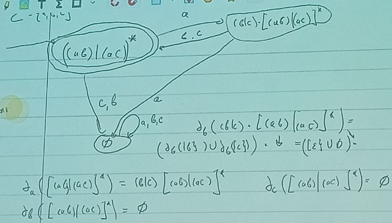
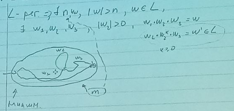
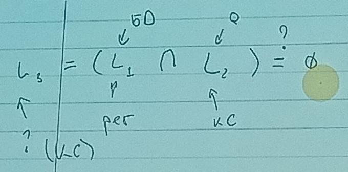

# 

### Существует алгоритм, который для любого автомата (даже не детерминированого) построит детерминированный, который задает такой же язык.
1. Устранение эпсилон-переходов (строим эпсилон замыкание между вершинами, если они связаны таким переходом). Все, кто в одном классе этого замыкания - новые вершины ("стягиваем" вершины)   
Как строить алгоритм транзитивного замыкания отношения?
2. Детерминизация   
Объединяем вершины, в которые выходим из текущей по одному символу  
> Алгоритм с рабочим множеством - почитать (поиск неподвижной точки)

## Минимальный конечный автомат
> Какое минимальное количество состояний достаточно для языка? Алгоритм основан на построении классов эквивалентности по конфигурациям.

При **минимизации** и **детерминизации** автомат сохраняется.

# Производная от регулярных языков
Производная языка по некоторрому символу - тоже язык, который состоит из слов, которые при конкатенации с символом, по которому берется производная - принадлежат нашему языку

$d_t(L) = \{w | t\cdot w \in L\}$

Пример $L=\{ab, bb, ac\}$,   
$L_1 = d_a(L) = \{b, c\}$,    
$d_b(L_1) = \{\epsilon\}$ НИИЕЕЕЕТ! НЕ ПУСТОЕ МНОЖЕСТВО! А МНОЖЕСТВО С ОДНОЙ ПУСТОЙ ЦЕПОЧКОЙ!!! ЭТО РАЗНОЕ!!!

Производные позволяют построить по регулярному выражению КА, избегая каких-то?? трансформаций.

Регулярные множества: 
$0, \{\epsilon\},\{t\} t \in \Sigma $

* d_t(0) = 0
* d_t(eps) = 0
* d_t({t'}) = if t = t' -> eps else 0
* $d_t(R_1 \cdot R_2) = $ а тут что? Давайте разберемся
>$d_t(R_1 \cdot R_2) = d_t(R_1)\cdot R_2 \cup R_1\cdot d_t(R_2)$   
откуда второе слагаемое? $\cdot$ не коммутативна, это операция конкаценации на строках.   
$R_1\cdot R_2 = \{w_1\cdot w_2| w_1 \in R_1, w_2 \in R_2\}$  
То есть во второй компоненте мы как бы вырезаем символ из середины.  
В R_1 может быть пустая цепочка, поэтому вторая компонента нужна только для нулевых w_1
* $d_t(R_1 \cdot R_2) = d_t(R_1)\cdot R_2 \cup \{0 ~ if \epsilon \notin R_1, else~ d_t (R_2)\}$
* $d_t(R_1 \cup R_2) = d_t(R_1) \cup d_t(R_2)$
* $d_t(R^*) = d_t(R)\cdot R^*$
> {ab}* = {eps, ab, abab, ababab ...}   
$d_a(\{ab\}) = b, bab, babab ...$

## Что такое цепочка, принадлежащая регулярному языку?
Q - регулярное выражение, $w \in L(Q)?$ Как проверить?   
$t_0...t_k=w$, берем производную от языка   

$(d_{tk}...(d_{t0}(Q))) = L'$, $\epsilon \in L'$ => $w \in L$

$\epsilon \in L' $ ? Проверим с помощью функции nullable
* null(0) = false
* null({eps}) = true
* null({t}) = false
* null($R_1 \cdot R_2$) = $null(R_1) \cap null(R_1)$
* null($R_1 \cup R_2$) = $null(R_1) \cup null(R_1)$
* null(R*) = true

## Как с помощью производных построить конечный автомат?
Если есть два регулярных автомата, то задача их эквивалентности разрешима.

1. Строим, объединяя равные состояние по ходу построения. Построение:     
Состояниями автомата будут регулярные выражения (это тоже множество). Стратовое состояние - Q, рисую переходы по всем символам из $\Sigma$. Дальше беру и повторяю. Конечное состояние - производная по этому символу от Q. $Q -> (t_i)d_{ti}(Q)$

2. Проверка **финальных** состояний. Финальное - то, для которого nullable = true

### Полный конечный автомат
автомат, у которого из каждого состояния есть дуги по любому символу алфавита.
### Дьявольские (тупиковые) состояния 
состояние из которых нельзя выбраться (но они не финальные). Нулевое не финальное по определению nullable. 

### Алгоритм regex -> KA, рассмотренный выше 
1. Основан на регулярках
2. Дает минимальный детерминированный (без эпсилон и с одним стартовым автомат)
3. Дает полный автомат
> Пример $((ab)|(ac))^*$

## Как сравнить две регулярки на равенство? 
Для языков: берем два конечных автомата и выполняем синхронный bfs, требуем чтобы все переходы были одинаковыми. 

Для регулярок: в данном алгоритме никто равенство языков/регулярок не проверяется. Но можно сделать в лоб: построить конечный автомат и т.д.

# Как проверить, является ли язык регулярным?
Иногда бывают нерегулярные языки. Будем говорить, что все регулярные языки удовлетворяют некоторому структурному свойству. Если оно не выполняется - язык нерегулярный. Лемма о накачке работает только в одну сторону: позволяет определить, что язык НЕ является регулярным. А точно сказать, является ли язык регулярным, с их помощью нельзя.
## Лемма о накачке (pumping lemma) 
Предположение: язык  L - регулярный.   
Тогда он обладает следующим свойством: $\exists$ константа $n : \forall w, |w| > n , w \in L: \\\exists w_1, w_2, w_3, |w_2| > 0, \\(1) w_1 \cdot w_2 \cdot w_3 = w, \\(2) w_1 \cdot w_2^k \cdot w_3 = w' \in L, k>= 0$    
Есть такая константа n, зависящая от языка, что если я буду брать достаточно длинные цепочки из языка, то будут существовать такие три цепочки, что 
* в конкатенации они дают w
* все конкатенации для произвольного k тоже принадлежат нашему языку
* w_2 - непустая цепочка
* w^k - в степени

Накачка: выбираем подцепочку и накачиваем им наш язык, пока не надоест

### Доказательство
* По любому языку можно построить минимальный ДКА. 
* В вершины может быть больше одного пути => можем построить цикл, отсюда берется n: в графе на m вершинах если путь больше m, то он содержит цикл.
* по этому циклу и будет "накачиваться" $w_2$

## Отрицание
язык не регулярный, если существует слово w > |n| : $\nexists w_1, w_2, w_3 : ...$(как в лемме).
## Пример: докажите, что $a^kb^k$ нерегулярный
Покажем, что нельзя накачать цепочку так, как описывается в лемме

# КС-языки (контекстно свободные)
### Определение
$G = <\Sigma, N, S, P>$
* N - нетерминальные
* $\Sigma$ - терминальные
* S - стартовое состояние
* P - правило перехода, $P : \{n -> w, n \in N\}...$
## Задание КС языков
### 1. КС-грамматики задают КС-языки
* БД -> L1 -> регулярный 
* Запрос: Q -> L2 -> КС (задает ограничения)
* Задача (в минимальной постановке, д**остижимость с ограничениями в терминах КС языков**): пересечь два языка и проверить, нулевое ли их пересечение. Это значит, что ни одного общего слова (пути) нет. Иначе можно будет найти представление этого пересечения (для регулярок он задавался конечным автоматом).

### 2. Какие-то магазины
где-то в книжках
### 3. Рекурсивные автоматы - Recursive state machines (RSM), recursive networks
> попытка обобщить КА для КС языков, припишем КА другую семантику.
## Пересечение 
$L_1 \cap L_2 = L_3$, $L_3$ - регулярный => КС языки замкнуты относительно пересечения с регулярными => мы знаем, как его можно описать.
# Нормальная форма Хомского
> Хочется придать доп свойства грамматике, сохранив задаваемый язык.

### Определение
Грамматика $G_1 = <\Sigma, N, S, P>$ находится в НФ Хомского, если:
1. S нет в правых частях правил
2. Если справа есть эпсилон, то только из стартового терминала
3. N -> t (не терминал в терминал)
4. $N_1$ -> $N_2N_3$ ($N_2, N_3 \notin S$) $(не терминал в два других не терминала)

Иногда язык, который описывает грамматику разделяют на две части: пустая цепочка (правило 2) и все остальное. Потом грамматику расширяют этим правилом. 

### Определение
Грамматика $G_1 = <\Sigma, N, S, P>$ находится в **Ослабленной НФХ,** если:
1. N -> t (не терминал в терминал)
2. $N_1$ -> $N_2N_3$ 

## Лемма
Любую КС грамматику можно привести к НФХ (и тем более ОНФХ)

* хомский
* ка для кс
* рекурсивные автоматы
