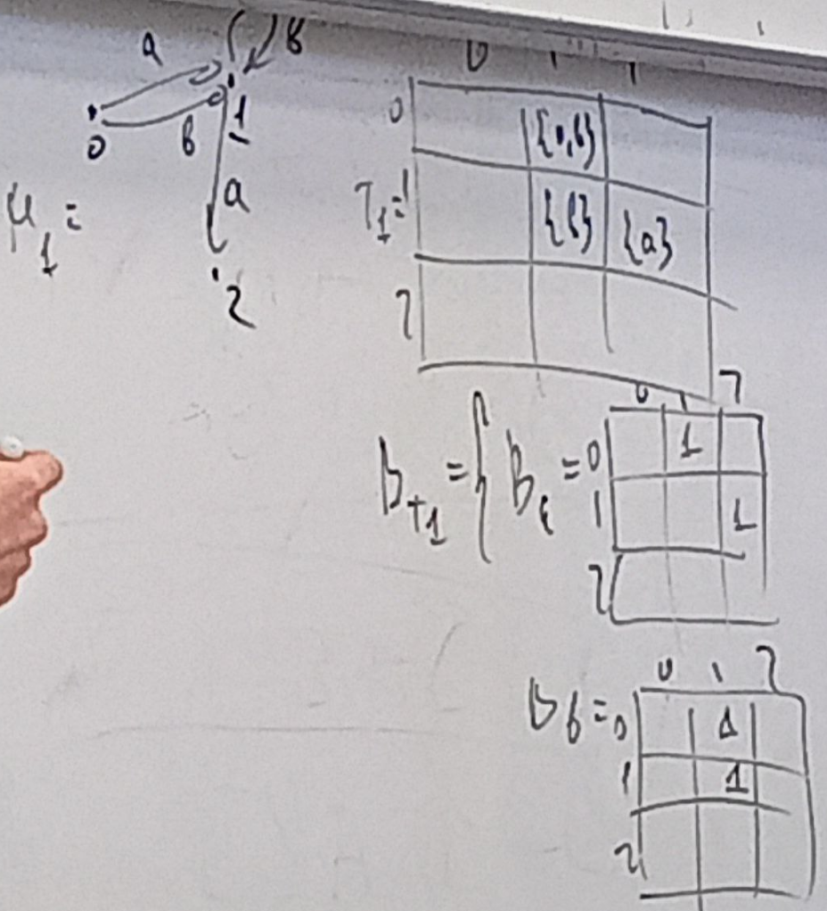

Хотим построить $M_3$ : $L_3 = L_1 \cap L_2$, тогда   
$T_3 = T_1~~x_k~~ T_2, x_k$ - произведение Кронекера, умножаем множество на матрицу.   Матрица смежности выходит блочная.

**произведение_кронекера**

Хотим построить пересечения, имея два автомата. Как он будет выглядеть?   
$M_3 = M_1 \cap M_2$
* $Q^3 = Q^1~x~ Q^2$ - декартово произведение 
* $\sigma^3 : (q_i^1, q_k^2) ->_t (q_j^1, q_l^2) <-> q_i^1 ->_t q_i^1 ~and~ q_k^2 ->_t q_l^2$

*картинка*

можно аккуратно доказать эквивалентность для конфигурации слов

можно смотреть на автомат как на некоторый граф с доп информацией о начальных и конечных состояниях

матрица а, матрица В. перемножаем - получаем, что каждый элемент а умножен на матрицу В. Используем для построения матрицы 
смежности Т. Она не коммутативна

А пересечение автоматов коммутативно. Как так? Перестановки состояний (строчки, чтолбцы) не меняют 
конечный автомат

К тому же всегда существуют N, M: $T_1~x~T_2 = M\cdot(T_2~x~T_1)\cdot N$

## AP-RPQ  (all pairs rpq) - достижимость между всеми парами вершин
КА в контексте регулярных запросов

* M1 = БД (всегда КА)
* * будем смотреть без эпсилон переходов
* * на практике не детерминировано (и поменять ее нам нельзя)
* М2 = Q (запрос, регулярное выражение из которого можно построить КА) остановимся на задаче достижимости
* * Q относительно маленький, задается пользователем, каждый раз новый 
> найти что есть путь между двумя вершинами, который входит в L2 ?

пусть в матрице смежности в ячейках хранятся матрицы. Если не определено произведение кронакера, то можем взять булеву декомпозицию матрицы смежности $B_i$: множество матриц ро каждому символу из алфавита (в ячейке Tk[i, k] живет символ t)
$$B_{Tk} = \{B_t | B_t[i, j] == 1 <=> t \in T_k[i, k]\}$$

## Как теперь перемножать 
Перемножаем все еще с помощью кронакера, но раньшше быыло пересечени множеств, а теперь - для булева пересечение посчитать гораздо проще
$$B_{T1}~x~B_{T2} = \{B^3_t =B^1_t~x~B^2_t, B^1_t \in B_1, B^2_t \in B_2 \}$$

На плотных матрицах это делать не надо (?)

## Транзитивное замыкание
* Транзитивное замыкание - булева матрица, которая для каждой пары вершин 1, если существует путь между ними.
* TC - transitive clouser T = T*
* Нам нужно знать, что есть какой-то путь между парой вершин, восстанавливать его не нужно. Этот автомат - персечение двух других, если слово в нем обнаружено - то оно есть и там, и там.
* Для транзитивного замыкание не важно, что лежит на ребрах. Нужен только путь. Поэтому можем сложить все булевы матрицы и потом транзитивно замкнуть.

* Транзитивное замыкание ищет достижимость для вссех пар вершин. А что если нужно только для определенной пары? Есть три варианта
* * придумать другой алгоритм
* * если бд статическая ил просто меняется редко - сохранить TC и отвечать потом на запрос за единицу
* * построив честную матрицу смежности использовать ее для поиска (Если пути коротенькие)

## А что вообще делаем
r, v - состояния

## MS-RPQ на основе MS-BFS
поиск путей с ограничениями от заданного множества стартовых вершин на основе MS-BFS (multiple source, от нескольких источников)
> т.е. раньше мы искали от всех до всех, а здесь только для относительно небольшого количества стартовых вершин.

* граф ориентированный, пока без меток на ребрах. мета-шаг: сменить все вершины с fronta  на другие

* front - булев веткор размеа n (входит ли вершина во фронт)
*  Tg - матрица смежности нашего графа, булева, n x n
 ### Как по матрице смежности и текущему фронту получить новый фронт? (пока без проверки на повторное посещение)?
 Из транзитивного замыкания: (Tg $\cdot$ Tg)[i, j] = $\sum Tg[i, k] \cdot Tg[k, j]$ 
 * произведение говорит, что между i и j есть путь через k
 * суммирование - агрегация по всем вариантам (k)

### А как для каждой вершины найти достижимые? 
* Если такое нужно в формулировке задачи
* Можно было бы запустить dfs от каждого исходного, но быстрее вместо вектора текущего фронта хранить матрицу, в которой каждый столбец соотвествует отдельной стартовой вершине.
* но ведь долго? да, но нааши матрицы разреженные, поэтому перемножаем с помощью специальный библиотек.

## Давайте хранить матрицу по-другому
*картинка*
* это плохо: настоящее состояние - декартово подмножество того,что отмечено 1. Но такие переходы не всегда есть. Пример: r ->t  l, r' ->t  l'
* нам нужно хранить доп информацию, поэтому вектора недостаточно

Действуем из предположения, что запрос (k) гораздо меньше бд, думаем, что верхняя матрица k - диагональная. Будем это поддерживать. 
* Зачем? Сама диагональность не зачем, просто визуально удобно контролировать, чтобы в столбце k было не больше 1 единицы.
* нижняя часть  - состояние в графе - кодирует вторую чатсь подмножества (второй элемент пары)