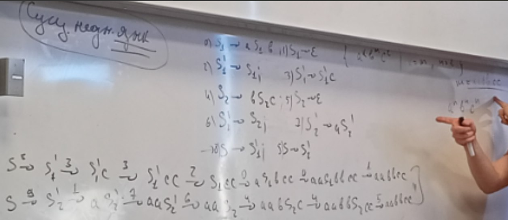
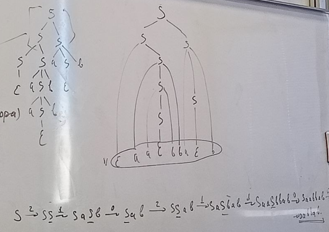

# КС языки
КС язык задается $G = <N, \sum, S, P>$, n -> w,  $w \in (N \cup S)^*$

стартовый нетерминал часто опускают (обычно это первое правило)

Пример: ПСП на 1 типе скобок (D(1))
$\\ S \rightarrow \epsilon$
$\\ S \rightarrow aSb$
$\\ S \rightarrow SS$

1. Это язык Дика над k типов скобок: D(k)
2. Это КС
3. Сокращенная запись для одинаковой левой части: 
$S \rightarrow \epsilon | aSb | SS$

### Порядок выбора нетерминала
1. Самый левый нетерминал (левосторонний вывод)
2. Самый правый (правосторонний вывод)
3. Недетерминировано

При фиксации порядка можно говорить о существовании вывода. Пусть есть лево и правостронний вывод. Можно ли сделать другой порядок вывода, но достигнуть того же результата (слова, цепочки, последовательности)? 

Если для данной грамматики существует цепочка, для которой есть больше одного лево или правостороннего вывода, то грамматика называется **неоднозначной**. Это не всегда плохо (см...). Но для ЯП хотим однозначных грамматик.

Иначе грамматика **однозначная** (если она выводима). Как доказать однозначность? Никак, для каждого случая придумывают свои алгоритмы. 

Это позволяет говорить об однозначном разборе, например, кода программы.

Не для любого КС языка существует однозначная грамматика. Тогда этот **язык существенно неоднозначный.**

Грамматика: может быть однозначный или не однозначной Для одного языка модет быть несоклько грамматик, один из них - может быть однозначной, а другая нет. Если для языка не существует ни одной однозначной грамматики, то он **язык** *существенно неоднозначный*.

## Пример
язык $\{a^kb^nc^l | k = m /\ = l\}$. Данный язы ксущественно неоднозначный. В нем будут проблемы с выводом цепочек вида $a^nb^nc^n$. Можем использовать их только как частный случай, но задать только цепочки с символами в одной степени - то не получится.
  

# Дерево ~~выгорания~~ вывода (дерево разбора)
Чего хотим: имея цепочку (строку) и грамматику хотим получить ее вывод

Дерево вывода цепочки w' в грамматике G
* корневое, корень - S
* упорядоченное (порядок сыновей узла важен)
* дерево размечено: 
* * листья - терминал или $\epsilon$
* *  узлы - нетерминалы
* Сыновья узла - задаются правило грамматики

* Крона (упорядоченные листья) - это в точности цепочка.
## Лес разбора
Если грамматика неоднозначна - будет несколько деревьев -> **лес разбора**. При их построении часть поддеревьев переиспользуется (персистентные деревья)

#### Пример построения дерева

Зачем оно нужно? Это структурное представление цепочки, с ним работать проще.

# НФХ (нормальная форма Хомского)
КС в НФХ, если выполняются ограничения на внешний вид правил:
1. Eps выводим только из S,  S нет в правых частях
2. $N_i -> t$
3. $N_i -> N_jN_k, ~~ N_j, N_k != S$

Любую КС(?) можно привести к НФХ

## Алгоритм преобразования грамматики в НФХ:
### 1. Устранение длинных правил
Если есть правило с длинной правой частью (длинная - это больше двух символов) $N_i -> a_1a_2...a_k$, введем новый нетерминал 
$\\ N_i \rightarrow a_1N_j\\
N_j \rightarrow a_2...a_k$
### 2. Устранение ϵ-правил
$N-i \rightarrow ϵ
\\ N_i \rightarrow b 
\\ N_j \rightarrow a_1...N_j...a_k $  

Делаем подстановку
$\\ N_j \rightarrow a_1...a_k$ 
$\\ N_j \rightarrow a_1..b..a_k$ 

Применяя сперва второе, а затем первое получим экспоненциальный взрыв:

$N_i \rightarrow N_1...N_k
\\ N_i \rightarrow N_2...N_k
\\ N_i \rightarrow N_1N_3...N_k $     

Поэтому лучше сначала убирать длинные правила, а затем убирать терминальные. Тогда тоже будет взрыв, но по степени 2.
### 2*. Устранение S в правой части
Что-то делаем

Или делаем трюк: делим язык на 2, убирая у него S-> eps. В новом языке есть какой-то S'. Добавляем правила S-> eps, S -> S'. Ура! Епсилон достижима только из S, а S только в левой части.

### 3. Устранение цепных правил
Цепные правила - их нетерминалы в 1 нетерминал. Делаем транзитивное замыкание по отношению $N_i -> N_j$ (классический алгоритм с рабочим списком). С его помощью доходим до "хорошей" правой части w', при этом все нетерминалы из цепочки "заменяем" на w' (не трогаем их слева, чтобы не попортить презультат пункта 1, но ставим вывод вместо N_i -> N_j на N_i -> w')

### 4. Чистка от бесполезных нетерминалов
Формально это обычно нигде не оговаривается, но по историческим причинам принято чистить грамматикку от **бесполезных** нетерминалов, они могут быть двух видов:
1. **Недостижимые** - никогда не будут учавствовать в выводе, если начинать их ставторового нетерминала. Поиск: обход от S вправо с рабочим множеством.
2. **Непорождающие** - никогда не могут породить терминальную цепочку. Поиск: обход от терминалов влево с рабочим множеством.

Порядок удаления типа 1,2 важен (поискать какой), но выполнять это нужно единожды.

### 5. 
У нас могли остаться правила 
1. $N \rightarrow  N_i~t$ 
2. $N \rightarrow  t~N_i$
2. $N \rightarrow  t_1t_2$

Но в НФХ дб только $N \rightarrow t$ или $N \rightarrow  N_iN_j$. Поэтому для каждого терминала (сущетсвующего в правой части вывода) вводим нетермиинал T -> t заменяем  на него терминалы.
1. $N \rightarrow  N_i~T$ 
2. $N \rightarrow  T~N_i$
2. $N \rightarrow  T_1T_2$

## Алгоритм преобразования грамматики в ослабленной НФХ:
ОНФХ - без правила 1.

# Алгоритмы: достижимость/выводимость в графе (ограничения КС)
Формулировка: решаем задачу достижимости с ограничениями в терминах КС языков: $R\{(u_i, u_j)| \exists u_i \pi u_j,  w(\pi) \in L\} $   
L - КС, проверяем выводима ли цепочка $\pi$: начинается в $u_i$, кончается в $u_j$
L -множество таких пар врешин, что между ними есть путь, который задает слово из нашего языка.

БД: $G = <V, E, L'>$ - какой-то граф с метками $E \in V x L' x V$ на ребрах

Запрос(ограничения) $ L - $КС $G'=<N, \Sigma, S, P>, L' \in \Sigma$
G' - ОНФХ =>
Имеем прввила -> Хотим граф с нетерминалами на ребрах. Если у нас есть v_i, v_j, множество Q на ребре v_iv_j => сущетсвует слово, которое порождается каким-то нетерминалом из!
1. N_i -> eps (выводима пустая строка)    
>
2. N_i -> t, N_j --> t (меняем метку на ребре с t на {N_i, N_j})
3. N_i -> N_jN_k --> 
