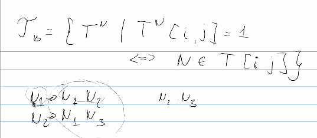
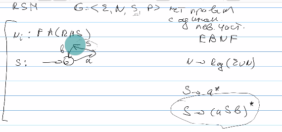
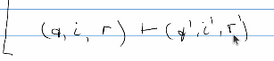
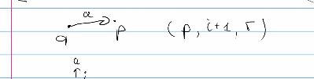
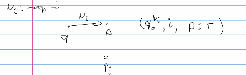
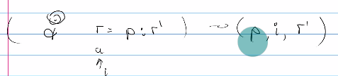
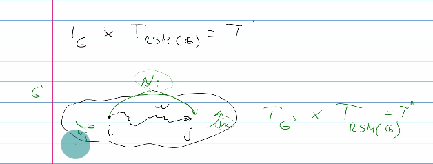
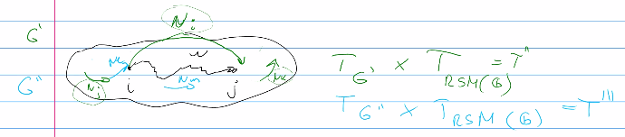

# Лемма о накачке для КС языков  
# Достижимость
приведем грамматику к ОНФХ
перемножение не транзитивно

Нужен какой-то перебор. Какой?

будем хранить в матрице все

но тоже сведем к булевым матрицам 

 при умножении учитываем правила грамматики

# Переложили алгоритм Хейленса к матрицам 
# RSM - recoursive state machine Рекурсивные
Это множество конечных автоматов, которые построены следующим образом: берем правило, соответсвующее каждому нетерминалу и строим конечный автомат по правой части правил

Как по грамматике получить rsm? 

Условие на грамматику: нет правил с одинаковыми левыми частями. Других ограничений на грамматику нет (в расширенной форме бекуса-науэра)

S: ... a-> S (это рекурсивный вызов того же S)

переход: 

он у нас недетерминированный (потом можем получить тупиковые конфигурации) и из одной вершины сразу мб несколько переходов, т.е. спаттерматчится по типу перехода не получится

1. переход по терминалу     
 q, i, r -> я в q смотрю на i-тый символ и имею стек r. Если есть простой переход - делаю его, стек не поменялся (q, i, r) -> (p, i+1, r)   

2. переход по нетерминалу   
По строке не двигаюсь, а стек меняю   

3. состояние финальное   
возврат из стека (строку не читаем, состояние меняем)     

А как понять, когда остановится? 

Пример
Пусть из символа выходит и обычный символ и нетерминальный 
стартовое состояние - автомат, соответсвующий стартовому нетерминалу

................

Знаем, что череда порождающих нетерминалов когда-то породит конечную цепочку

Построим матрицу смежности (g и rsm - матрица смежности автомата), которая будет пересечением с регулярной чатстью G. Найдем ее с помощью произвдедения Кронакера. (знаем, что определенные пути куда-то как-то выводимы: храним информацию о том, что для нетерминала M есть какой-то путь)

Было: G, узнали что по  N_i есть путь ij. Добавим эту информацию в граф. Получили G'. Повторяем. Теперь в путях участвуют нетерминалы, добавленные в граф. То есть по сути пересекаем два конечных автомата
 

Считаем Кронакера
Считаем транзитивное замыкание
таких операций много: оценка

Алгоритм:
1. gG - грамматика. Строим по ней RSM. Строим по ним матрицу смежности
2. G - граф. Строим матрицу смежности для него (в одной матрице, мб не свзяным. нужно уникально занумеровать вершину)
3. перемножаем матрицы T' по кронакеру. Теперь можем посмотреть, есть ли между вершинами путь. 
4. Считаем транзитивное замыкание T', чтобы посчитать новые дуги с нетерминалами
5. модифицируем матрицу смежности Tg = Tg + (информация о новых дугах. добавляем ее, только если между ij есть путь в графе и есть правило между ij в грамматике)
6. В цикл, пока на 5 этапе есть что добавлять. Получаем новый конечный автомат над **смешанным алфавитом** (в смысле изначально в задаче разделены терминалы/нетерминалы, но в автоматах меток содержаться и то и другое)

ПРИМЕР ОБЕЩАЛИ НА СЛЕДУЮЩЕЙ ПАРЕ