# Рекурсивные автоматы 
# Алгоритм Кронакера: пример
Любая КС грамматика может быть представлена как рекурсивный автомат <конечный автомат с нетеррминальными состояниями>

Пример: язык вложенных скобок   
$G: S -> aSb | ab $

Смотрим на автомат, для каждого нетерминала строим свой КА (конечный автомат). Например, для S
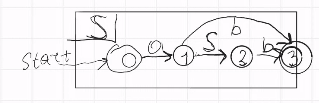
Для каждого нетерминала такой бокс

Рекурсивный автомат: нетерминальный символ - это рекурсивный вызов КА того символа, который распознается на ребре (н-р, на ребре 1-2)

Можем представить их в одной матрице смежности, т.к. 

Минусы матричного алгоритма: нужно преобразовывать грамматику, это долго, к тому же она будет разростаться.

Для нашего алгоритма это не НФ.

Алгоритм Кронакера 
Берем матрицу смежности рекурсивного автомата
Вычисляем произведение кронакера с матрицей смежности графа
у результатат берем транзитивное замыкание, пока что-то изменяется

Пример:  
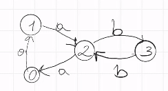  
Если длины циклов взаимно простые, то повторяем уикл столько раз, сколько нужно

Каждый из объектов представим в виде объекта линейно алгебры (матрицы смежности)
 M1 - матрица рекурсивного автомата. Размер матрицы - nxn, где n - количество состояний  
 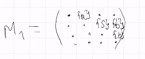  
 На практике работает с булевой декомпозицией (для нетерминалов отдельная матрица)
M2 - матрица запроса-графа
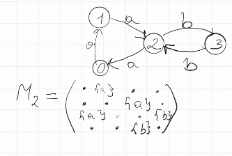 

Зачем использовать произведение Кронакера (тензорный алгоритм) o ?
Когда M1_(p x q) o M2_(n x m) = M_(pn x qm)  
Каждый блок матрицы соответствует элементу в M1, а его размер соответствует M2 (p x q (размерность блоков) блоков размера n x m (внутри блока), т.е. каждая ячейка может быть задана парой координат: номер блока и номер ячейки внутри блока) => M(i, j)  
* j / n = номер блока по вертикали 
* i / n индекс блока по горизонтали
* i % m - номер элемента внутренней матрицы по вертикали
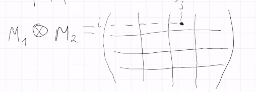

## Итерация 1. 
### 1.1 Заполнение матрицы
Веь элемент M1 скалярно умножается на матрицу M2. М хотим, чтобы произвдение Кронакера позволило одновременно путешествовать по рекурсивному автомату и графу (т.е. обходить одновременно) и искать общие пути. Если нашли путь в графе из v0 в v3 и ему соответсвует какой-то путь в рекурсивном автомате, причем это путь из стартового в финальный => мы нашли выводимый путь из S.

Чтобы переходить по каким-то ребрам в автомате и графе 
* эти ребра должны существовать
* метки должны быть одинаковые 

Для блока 01 чему может соответствовать переход переход между состояниями 0 и 1 в исходной матрице? Что-то для символа $а$, поэтому перемножим все из второй матрицы, оставив лишь символы а.

Для булевой декомпозиции - делаем объединение разных способов (символов)

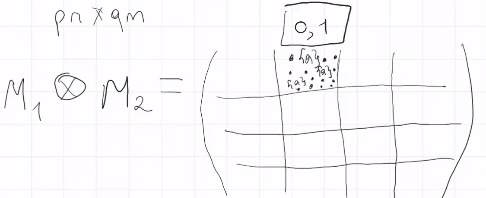

В M2 нетерминалов S нет => 1, 2 пустая. В 1,3 и 2,3 оставляем только b. Все остальные блоки пусты.

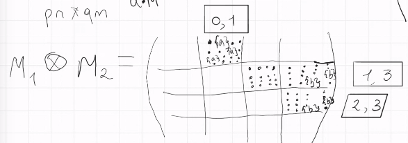

Теперь можем одновременно путешествовать и в рекурсивном графе, и в автомате.


### 1.2. Транзитивно замыкаем
Считаем транзитивное замыкание M3. Старые элементы не исчезнут, а новые появятся. Что это такое?  Какие пути длины 2 есть и в автомате и в графе?

a->b (0-1-3) в автомате (1-2-3) в графе.
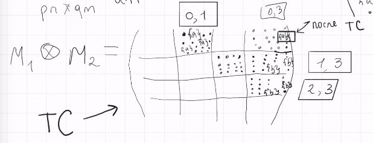

Что нам нужно от пути в автомате и какие ограничения на пути в графе? Нас интересуют пути только из стартовой в конечную. ДЛЯ КАЖДОГО НЕТЕРМИНАЛА тоже учитываем стартовые и конечные. Нас интересует только блок 0-3 (т.к. 0 - начальное, а 3 - конечное в КА). Теперь в граф добавляем новое ребро с этим нетерминалом в граф с меткой S (т.к. оно стартовое и финальное для него. Если для нескольких нетерминалов это и стартовое и конечное - добавляем все (мб два ребра провести, в матрице объединяем их в множество))


* Куда добавлять? Блок 0-3, т.к. строка от 0 до 3 состояние
* Что добавлять? Нетерминал, для которого начальное состояние - стартовое, а последнее - конечное.

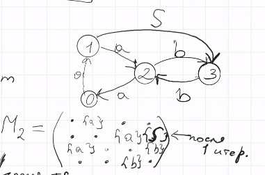
## Итерация 2
### 2.1 Произведение
Теперь в произведении сохраняется и блок с S (в 1,2) (ab в 0,3 нет! просто стирать не сталиб т.к. после следующего ТС он все равно появится)

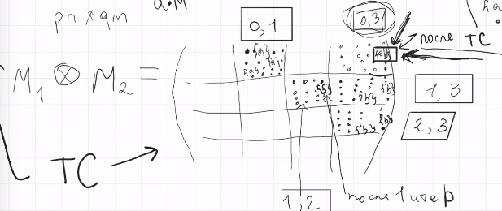
### 2.2 TC
появится ли что-то новое? Смотрим на граф. Да! У нас есть путь a-S-b 0-1-3 (имеем a-S, в 0,2 S-b в 1,3 и a-S-b в 0,3)

А как a-S получили? а: 0,1, S: 1,2 результата в блок 0,2. А какая ячейка? в графе этот путь это 0-1-3 => записываем в 0, 3

Нас снова интересует только 0,3 (т.к. там из стартовой в конечную для S). Там в 0,2 ненулевое содержимое => существует одновременный обход a-S-b 0-3 в КА и 0-2 в графе

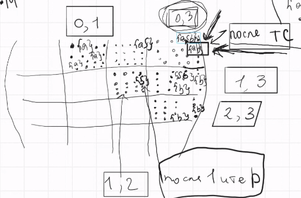

Добавляем ребро!

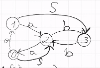

Почему этот алгоритм завершается? На каждой итерации добавляются ребра только с нетерминальными символами. Граф конечный, добавляем только новые ребра => можем добавить конечное число символов.

Если в графе есть циклы, то может быть бесконечное количество путей с бесконечным количеством слов языка. Остановка происходит, т.к. нам хочется найти только факты существования пути между парой вершин.

Как сделать произведение Кронакера? Декартово произведение состояний (первое число - состояние в первом графе, второе - во втором), смотрим где есть общие пути

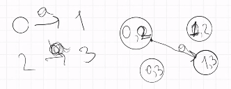

Теперь можем искать и достижимость всех путей и достижимости.

Достижимость: достижимы все ребра, между которыми есть ребро со стартовым нетерминалом S (т.е. они достижимы).

Если k различных нетерминалов, то можно построить один большой автомат


# LL алгоритм
> Парсинг, синтаксический анализ строк

```py
def LL(w: str, ks: grammar) -> <w in ks or not?>
```
ks = G ($\Sigma$, N, P (production), S)
рекурсивный спуск: 
1. Для каждого нетерминала создаем функцию   
Вход: необработанный остаток строки w'.   
Выход: результат (выводится ли этот остаток из нетерминала), еще необработанный остаток   
То есть для суффикса w' ищем префикс, который выводится из нетерминала.   
2. пробуем сматчить для каждого нетерминала
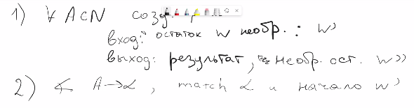

Пример: алгоритм рекурсивного спуска 
```py
G : S -> aSbS | eps
def S(w) -> Bool, str: 
    """
    Возвращает, True, если из суффикса строки w выводимо что-то по правилу, где слева был S и оставшийся после вывода новый суффикс
    Алгоритм: смотрим на все правила, где слева нетерминал S и пробуем матчить строку с парвыми частями
    """
    if w == eps:
        # w пустая, а S порождает пустую строку
        return True, eps
    if w == a::ta:
        res, tta = S(t)
        if res and tta == b::bt:
            return S(bt)
        else: 
            return (false, tta)
    else return (False, w)

```
Получаем True, eps если вся строка принадлежит языку
Не работает, если
* леворекурсивная грамматика (уйдем в бесконечную рекурсию)
* выводит только 1 вариант, если грамматика неоднозначна

LL Left to Right, Lower (нисходящий), Look ahead for k next signs(чтобы выбрать, какое правило применить)    
начинаем со стартового нетерминала, применяем правила и раскрываем
Какое правило для S выбирать? Любое, спускаться вниз. Если не вышло - возвращаться и выбирать другое. А LL без таких откатов, то есть назад мы не возвращаемся что лишает нас проблем с зацикливанием и рекурсией.

Идем по строке слева направо. Начинаем со стартового нетерминала. Чтобы хранить информацию о том, по каким правилам мы пришлм (последовательность терминалов и нетерминалов по пути дерева, кладем в стек)
Если в вершине стека нетерминальный символ - пытаемся применить правило, если терминал - смотрим на указатель строки. Там тот же терминал? Если да, то удаляем из стека терминал и сдвигаем указатель.

А как выбрать нужное правило? 
LL look ahead

Таблица: строка: символ, столбец: что видим на входе (после указателя в строке). Если такие символы и нетерминал А на вершине стека, то применяем правило A -> alpha

Если на верхушке стека терминал - проверяем, что в строке тот же терминал и двигаем указатель. Иначе обращаемся к табличке.

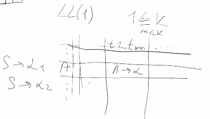

Как создавать такую таблицу?
Для грамматики вычисляются два множества first и follow  
first k - первые k терминалов, которые могут быть выводимы из нетерминала А  
follow k - какие первые k терминалов могут идти после нетерминала А   

Нужно вычислить их для всех нетерминалов. Как? 
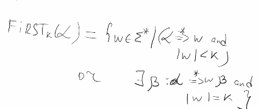 
$def Fistrk(\alpha) = {w \in \Sigma }
$
a - любая последовательнотсть терминалов и нетерминалов
```
followk(beta): все такие строчки, что существует гамма и альфа: при каком-то выводе из стартового нетерминала S мы можем полусить гамма_бета_альфа и w - это first(alpha) 

follow - это first a от того, что остается после вывода А
образует класс LLk грамматик (когда мы по табличке однозначно можем выбрать правило: LL1, LL2 и т.д.)

LR восходящая   
начинаем со всей строки и что-то делаем 
```
Если правила в таблице недетерминированные:
1. Пробуем LL(k) k побольше. На практике почти все разрешается LL(1)
2. Поднимаем лапки к верху и говорим, что эта грамматика не LL(k)


LLk не всегда хватает:
1. O(n)
2. не работает для не LL(k) грамматик   
> $\exists$ грамматики, которые КС, но не являются ll(k) для любого фиксированного k. Н-р: $a^nb^m$, n > m. На сколько нужно заглянуть вперед, чтобы пропустить все а? Всегда зависит от строки.    
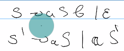
3. (скрытая) левая рекурсия   
> ее можно устранить, но тогда тяжело интерпретировать результат алгоритма

# Пример LL(1) алгоритма
Грамматика   
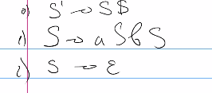

first/follow  
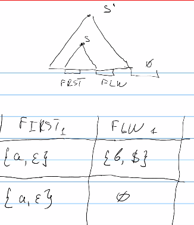

Теперь можно заполнять управляющую таблицу  
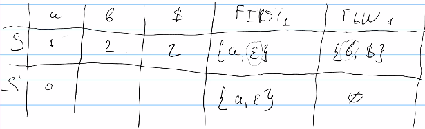  
Пример:   
w = (ptr) a a b a b b $  
Стек: изначально 