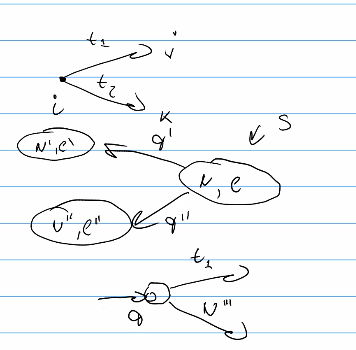
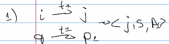
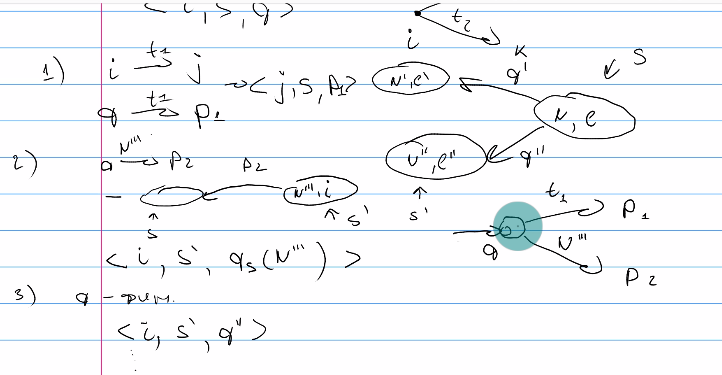
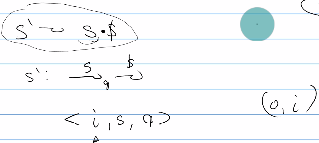

# GLL - Generalized LL
O($n^3$) для плохих грамматик  
 O(n) для хороших (однозначных) грамматик и линейного входа ()

### Дескриптор 
Дескриптор - набор состояний, однозначно описывающий конфигурацию алгоритма. Для конкретной строки взяв конкретный дескриптор можем продолжить разбор. 

Состав:
* i - указатель на вход
* s - указатель на стек
* q - состояние RSM

**D = <i, s, q>**  
Алгоритм: распознаватель, говорит "да/нет", но не строит дерево разбора.

`Q` - рабочее множество дескрипторов на обработку. Каждый дескриптор (как и конфигурацию в КА) обрабатываем ровно 1 раз.    
`R` - обработчики дескрипторов -    
### Stack
`Stack` - представлен в виде графа  
вершина `v = <N, i>`, где `N` - нетерминал, `i` - позиция в исходной строке, где он был обнаружен  
ребро `e = <адрес возврата>`. Ребро оринетировано, входит в вершину ниже по стеку. Петля соответствует левой рекурсии. В цикле тоже может быть скрыта левая рекурсия.   
Все вершины и ребра **уникальны**.

pop - физически не удаляем вершину, а смещаем указатель

push - проверяем, что таких вершин и ребер еще не было в графе. добавляем

### Вход алгоритма: RSM, граф
Stack: s, 0 (стартовый нетерминал и нулевая позиция)  
<0, s, $q_s$(s)>, s_0 - корень стека
### Основной цикл:

``` 
пока Q не пусто
    берем очередной дескриптор q = <i, s, q>
```



```
    обрабатываем. возмодно, порождаем новые дескрипторы
```


``` 
    Смотрим RSA. 
    добавляем в q не обработанные ранее дескрипторы q',
    которые порождены при обработке q
```
Как может выглядить дескриптор? варианты следующие (не взаимоисключающие)
1. Смотрм на вершину графа, почеченую треминалорм и на вершину  RSM стем же самым терминалом. Сместились и там и там, стек не поменяли
2. смотрим на RSM и видим, что торчит нетерминал => нужно начать распознование нетерминала => сделать вызов => раблота со стеком. Смоей позиуии - пуш на стек + адрес возврата - место, куда нужно будет вернуться.
3. q - финальное состояние, могу звершить распознование нетерминала. Смотрим на исходящие ребра (предшествующие фреймы стека), смещаю указатели вершины (новый адрес). Прошли по вссем исходящим состояниям и породили новых дескрипторов. pop со стека (обработали какой-то нетерминал). 
4. Ничего - дескриптор странный, выкидываем его




В общем случае порядок обработки дескрипторов не важен, но может быть неприятная ситуация

... делали/ делали ... сделали pop и породили два новых дескриптора s', p'; s'', p ''

Породили <j, s', p'>,  <j, s'', p''> и появилось ребро p'''. Это катастрофа, т.к. что-то там не породим больше

Поэтому в вершинах со стека хранится некоторая коллекция p, которая говорит о том, какие попы были сделаны. И когда добавим новое ребро - поймем, что нужно не забыть сделать pop. Иначе потеряем ответов.


Когда получаем ответ (что строку можно породить)?      
Расширим грамматику правилом (изначально стартовая S)   
   
А можно проверить, что мы в конечном состоянии стартового нетерминала. Но это сложнее (нужно не забывать продолжать обработку шагов 1-3, т.к. из конечного могут исъходить и другие пути)

Преищумества:
* позволяет решать задачу для фиксированного количества стартовых вершин (предыдущие два - allPairs). Задаем тогда, когда складываем стартовые дескрипторы.
* если мы используем rsm, то для регулярного запроса получим что-то вроде конечного автомата => отработает не хуже, чем пересечение регулярных языков.
* аккуратно реализованный работает быстрее матриц
Недостатки
* для ускорения работы используются нетривиальные структуры данных => ей сложно распараллеливать.

