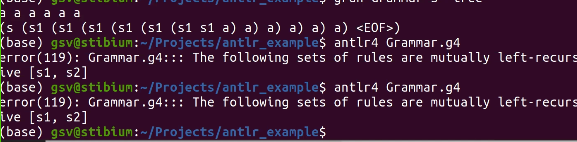

# Синтаксический анализ ЯП

## Автоматические инструменты
Когда оправдано их использование?
1. Прототипы    
Т.к. какие-то характеристики синтаксического анализа (выразительность языка, производительность) менее важны, чем скорость разработки
2. Разработка DSL (Domain Specific Languages)
3. Специфичные случаи анализа    
Когда можно без потерь скипнуть конструкции кода: подсветка в IDE и т.д.

### 1. Генераторы

* Имеем спецификацию лексики и синтаксиса языка (на каком-нибудь стандартизированном языке g4, EBNF) 
* Генератор (синтаксических/лексических анализаторов)    
по описанию генерирует информацию, которая необходима для синтаксического разбора и зависит от грамматики (например, управляющую таблицу  forst|follow и т.д., на картинке в виде java кода) 
* dll - то, что от входа не зависит. Например, PDA - push down automata принимает на вход таблицу и вход и что-то делает (строит дерево и т.д.)

Вещи, которые зависят и не зависят от грамматики объединяем в рамках одного конкретного проекта.

\+ Производительность    
\- DSL ограничен, в генерируемый код руками лезть не принято

Примеры:
* `yacc`
* `bysion`
* `ANTLR`   

### 2. Parsing combinator
крайний случай генераторов - библиотека функций, которые позволяют сразу строить примитивные парсеры и собирать из них более сложные. Реализуем в своем проекте анализатор на базе этой библиотеки. 

* Не имеем внешнего dsl (обычно библиотека на том же языке, что и сам проект)
* в явном виде этапа генерации не имеем    
на самом деле про метапрограммирование (где-то под капотом там что-то интересное таки происходит)

\+ Гибкость

# ANTLR 
\+ быстрая, надежная система     
\+ умеет генерировать на многих языках      
\+ с восстановлением после синтаксических ошибок из коробки (*error recovery*)    
\- не может в инкрементальность

Генерирует:
* парсер
* дерево
* код для более-менее типичного обхода дерева разбора

### Инкрементальность
Способность проводить разбор только в тех участках кода, где были изменения.    
Зато это умеет `TreeSitter` (создавался для генерации инкрементальных синтаксических анализаторов). Зато имеет проблемы с *error recovery*

## Обход дерева разбора AST
Есть два подхода
1. **Visitor**    
Можно от них наследоваться и расширить функциональность только для тех типов узлов, которые нам интересны.    
Это доказательство того, что преобразование грамматики не очень хорошо: как искать такое в сгенерированных файлах?
2. **Listener**   
Подписываемся на события: генерацию узла определенного типа.

## Варианты использования
1. Разделить лексер и грамматику
2. Все бахнуть в одну кашу

## Примеры работы

На некорректной строке инструемнт молча вывел дерево для того, для чего смог (для максимального корректного префикса)

Чтобы это обработать можно попросить считывать до конца входа (до конца потока ввода)
  

Корректный разбор: 

### Язык Дика   

## Примеры плохой работы
1. Левая рекурсия
не леворекурсивно   

леворекурсивно (непосреллствено)

скрыто   

чинится свездочкой    

2. не LL(k)
$a^nb^m, n > m$ 

Попробуем честно написать без звездочек (под капотом работает как со звездочкой )

3. Существенно неоднозначные языки  
работает с ними, потому что умеем управлять порядком альтернатив 

   
выдало, что сбалансированы b и c. Потому, что порядок альтернатив имеет значение!

сделаем дисбаланс    

Приоритет и ассоциативность тоже задаются на уровне грамматик (этот пример в antlr не работает, там выберется первая альтернатива и все)

# Азы разработки ЯП
Бывают абстрактный и конкретный синтаксисы    
Чем выше абстракция - тем меньше деталей нужно при разборе    
Конкретный синтаксис сомтрит на скобочки и т.д.    
**Для интерпретатора** важна структура типов узлов, а не синтаксис. Например:
 * у условных операторов на всех языках есть общая структура)
 * 

 # Интерпретатор 
 Работает с AST (деревяшкой, которую выплевывает парсер). Как можно его обходить?
 
 ## 1 Снизу вверх
 Такого обхода не хватает, например, при использовании переменных или пользовательских функций.
 

????????????????????????????????

# Язык запросов к графам
(маленький Cypher)

* Данные - файл на диске
* Решаем задачу достижимости
* Хотим использовать регулярные и КС ограничения

Возможности языка
* выбрать граф (from graph_x)
* задать стартовые вершины в графе    
как в multiple source, обычно по дефолту все стартовые и все финальные
* описать ограничения    
регулярный запрос/ КС грамматику и т.д.
* ответ на задачу     
предусмотрим возможность пояснять, в каком ответе ждем ответ     
\- список пар вершин (s, f)    
\- только конечные: список, до куда смогли добраться (f_1, ...f_n)    
\- правда ли, что ответ пустой? (boolean). Как функция агрегации в sql (isEmpty/count)    

Ожидается скриптовый язык. Запросы/ограничения чередуются.

Пример

