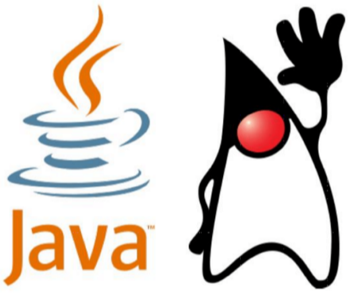

# ИСТОРИЯ И ЭВОЛЮЦИЯ JAVA
* 1991 внутренний проект Sun Microsystems по созданию платформы для разработки **встраиваемых систем** — Green Project;

вместо C++ (отравительного стандарта) решили создать новый язык, названный Oak
* 1992 первое демонстрационное устройство на новой платформе — PDA Star7. Работает бесконечно медленнее С++ 
* 1993 попытка занять нишу ТВ - приставок для кабельного телевидения. Для него был необходим GUI, сделали его кроссплатформенным  
* 1994 фокус на разработке интерактивных приложений (апплетов) для веб - страниц; 

динамический контент генерировался на с++, каждый раз новая страница. Java applets были первыми (потом silverlite, flash) как приложение. Интерент был медленным, поэтому то что ява медленная - никому не мешало. => бэк тоже писали на яве. это оказалось быстрее, чем на плюсах (код проще поддерживать, порог входа ниже)

язык переименован в Java 

* 1996 Java Development Kit 1.0 JLS 1.0, JVM 1.0, минимальная стандартная библиотека 
* 1997 JDK 1.1 , JLS 2.0, ...для кофеварок... 
* 1998 J2SE 1.2 , «Java 2», разделение на SE/EE , JVM 2.0 
* 2000 J2SE 1.3, выделена ME (те самые игры на Java)
* 2002 J2SE 1.4 
* 2004 J2SE 5.0 (2.5.0), изменение нумерации , JLS 3.0 

Производительность выосла радикально (jit, архитектура, модель памяти), добавлено много фич (generics), полностью переписана модель памяти для многопоточного программирования 

модель памяти - соглашения между программистом и ЯП относительно многопоточности. в питоне вообще все потоки, кроме главного засыпают. в с работало почти как в ос процессы. а в яве 5.0 все сделали круто и даже плюсы пытаются это подтянуть

В плюсах нет Oota - out of the air (что ответ не может быть взят с потолка)

```cpp
int a = 3;
int b = 42;
...<<здесь к а не обращаются, можно не записывать в нее 3>>
a = 7;
```
Если в параллельном потоке выводится а, то она может выести 42 (т.к. компиятору выгоднее сделать групповое присваивание а и b)
* 2006 Java SE 6, уход от понятия «Java 2» 
* 2011 Java SE 7 
* 2014 Java SE 8, Stream, lambdas

На яве писали и desktop приложение 
* Minecraft
* Eclipse
* IDEA

Android тоже 

* 2017 SE 9 модули
* 2018 SE 10 Var
* 2018 SE 11 JShell 
* 2019 SE 12 
* 2019 SE 13
* 2020 SE 14
* 2020 SE 15
* 2021 SE 16
* 2021 SE 17 LTS

При всех при этом поддерживается обратная совместимость, поэтому некрасивый синтаксис выпилить нельзя.

ПРОИЗНОСИТСЯ КАК JAVA. НЕ ЯВА!
### Duke

# ВИРТУАЛЬНАЯ МАШИНА И БАЙТКОД 
* Подход C/C++:

 исходный код →(компилятор) машинный код → процессор 
 
* программа работает только на той платформе , под которую она скомпилирована
* работает быстро на железе
* Подход Java : 

исходный код → байткод виртуальной машины → виртуальная машина → процессор 
* программа работает на любой платформе , где есть виртуальная машина Java
* компилируется в байткод, интерпретируется на jvm (?)

Зачем копилировать? 
* проверка при компиляции
* оптимизации при компиляции
* jvm можно не трогать, переписывая язык сколько угодно раз

Почему не объектный код?

Зачем JVM?
* чтобы запускать на разных платформах (если будет jvm под конкретную платформу)
* при этом виртуальных машин на разные платформы меньше, чем компиляторов

Важность кросплатформености java в том, что она гарантирует **ОДИНАКОВЫЙ РЕЗУЛЬТАТ** на разных платформах (у с++ разные чары и инты на разных плаформах, например). Поэтому виртуальная машина должна быть **СЕРТИФИЦИРОВАНА**

## Как быстро работает виртуальная машина? 
*  Интерпретация байткода на порядок (10 – 20 раз) медленнее исполнения аналогичного машинного кода. . . 
* но есть Just - In - Time компиляция
1. виртуальная машина компилирует байткод в машинный код 
2. используется с JDK 1.2 
3. jit компиляция позволяет делать девиртуализацию (зачем делать ее виртуальной, если она не используетс или наследников нет)
4. Есть и ддругиепримеры оптимизации, которые допустимы только в процессе выполнения 
5. При выоплнении собирает статистику, что улучшает качество оптимизации ()
* а также HotSpot ( основная виртуальная машина Java для настольных компьютеров и серверов, выпускаемая корпорацией Oracle ) • адаптивный оптимизирующий JIT - компилятор • используется с JDK 1.3 • в результате Java 7 всего в 1.5 – 2 раза медленнее C , а в некоторых тестах не хуже или даже быстрее

## СБОРКА МУСОРА 
* Подход C/C++: 

выделил память → поработал → освободил память всё управление памятью в руках программиста 
* Подход Java : 

выделил память → поработал → забыл виртуальная машина считает ссылки на объекты освобождает память, когда ссылок больше нет (это **неправда**, потому что циклические ссылки)

чтобы это избежать смотрим на переменные на стеке, запускаем дфс (еще можно от глобальных объектов). все, до чего добрались - может быть вызвано. все остальное можно удалять.

Когда это делать?
* ставить на паузу и удалять (медленно)
* по-другому (будет отдельная лекция)

Утечка памяти в джава - ситуация, когда сохраняем ссылку на большой объект, когда он не нужен.

Например, беря подстроку от большой строки - сохраняем указатель на всю строку (т.к. они неизменяемы). Поэтому храним все, хотя можем не использовать.
## БЕЗОПАСНОСТЬ 
* Верификация байткода • некорректный байткод будет отвергнут перед исполнением 
* Автоматическое управление памятью • нет арифметики указателей • невозможно испортить память 
* Встроенный механизм управления правами • можно запустить код в «песочнице» без доступа к файлам, к сети , без возможности создавать потоки и т. п

## МНОГОПОТОЧНОЕ ПРОГРАММИРОВАНИЕ 
* Многопоточность • встроенная поддержка потоков • богатая библиотека примитивов синхронизации 
* Распределенность (ситуация, когда код на нескольких пк обрабатывает что-то а потом собирает обратно) • встроенные сетевые возможности • пересылка данных и объектов по сети • работа с удаленными объектами (RMI)
# JRE/JDK 
* Java Runtime Environment (JRE) Только запуск!

 виртуальная машина и стандартная библиотека классов для запуска скомпилированных программ 
 
 * Java Development Kit (JDK) И запуск, и разработка
 
 набор инструментов для разработчиков (компилятор ), включает в себя JRE 
 
 * Документация (oracle, jvm) • на JVM • на Стандартную библиотеку
## РЕДАКЦИИ JAVA 
Язык один и тот же, разные jvm и мб способы запуска программ
* Standard Edition (SE) в основном десктоп, будем говорить в первой части курса
* Micro Edition (ME) подмножество SE + специфические библиотеки, мобилки
* Enterprise Edition (EE) мб будем говорить во второй чатси курса. 

SE + дополнительные библиотеки и возможности. Как правило, для бэкенда. (как правило, создается контейнер, исполняет код, удаляет контейнер)
* Java Card сильно урезанная версия SE, изменения в виртуальной машине
# РЕАЛИЗАЦИИ JAVA 
* Oracle Java • http://java.oracle.com/ оптимизирована именно для продуктов oracle
* OpenJDK • http://openjdk.java.net/ открытая реализация java, основной контрибьютор которой - oracle
* IcedTea • http://icedtea.classpath.org/ 
* IBM J9 беконечно хорошо оптимизирована для серверов ibm
* еще несколько десятков
## АЛЬТЕРНАТИВНЫЕ ЯЗЫКИ 
На Java машине можно запускать программы на любом языке, компилируемом в байт - код JVM 
* Groovy , Kotlin , Scala 
* Clojure Диалект LISP 
* JRuby Реализация Ruby на JVM 
* Jython Реализация Python на JVM

# HelloWorld.java 
```java
/**
* Created by AntonK on 03.09.15.
* @author Anton Kuznetsov
*/
public class HelloWorld {
    /* Example program */
     public static void main(String[] args ) { 
        // Make some magic
        System. out .println ( "Hello, flower" ); 
        } 
        //строка - объект с полем length
        for ( int i = 0; i < args. length ; i ++) {
             System. out .printf ( ", %s" , args [ i ]);
        }
    } 
```
1. Java completly OOP
2. main 
* чтобы запуститься дб публичным и статическим
*  аргумент 1, т.к. массив в джаве всегда имеет длинну (в с++ еще количество аргументов)
3. Классы имеют идентификатор доступа. У публичного класса название файла дб такое же, как имя файла. =>  в файле java мб только 1 публичный класс. 
> зачем это сделано? удобно, точно знаем где что. еще важнее, что компилятор точно знает => не нужно ничего инклюдить
4. Java Coding Conventions (скобочки, наименования и т.д.)
* с большой буквы имена только классов и констант
* только camel case (кроме констант, они snalecase (capslk))
5. Нет перегрузки операторов
```java
for ( int i = 0; i < str.length (); i ++) {
     result = result*10 + str.charAt ( i ) - '0' ; 
     }
```
