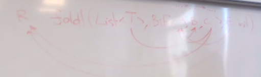
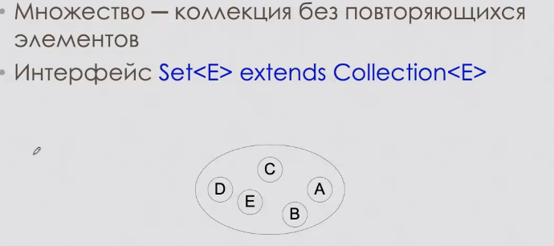

.. foldl (List<...>, BiF<..,.,..>, Init..)
(1) foldl (List<(2)>, BiF<(3),(4),(5)>, Init(6))
6 типов. Пусть может быть пустой список
(R) foldl (List<(T)>, BiF<(A),(B),(C)>, Init(E))


Проблема: каждый из типов Е и С являются наследниками двух типов, которые связаны друг с дургом.
Утверждение А.М.: 
в системе типов языка джава это не разрешимо
Решение 1: Аксиома Эридана (синее)

* T -> B все ок
*      
В этом есть одна проблема: неявно пораждается связь, порожденная мерзким черным цветом. Теперь не можем сделать A --> R


Есть Е, который наследуется от R и от А, есть C который наследуется от R и от А. Давайте предположим, что R и А в одной иерархии. Тогда нужно поставить кого-то сверху. Пусть R
Это работает для всех случаев, кроме тех, когда R наследник А.

Решение 2: связать E и C.

Проблема: возвращаем R, но он не дженерик и можем апкастнуть.
# Коллекции
## Collections<E>
неупорядоченный (по индексу) набор элементов     
Если возьму два итератора и пробегусь по коллекции, то получу разные по порядку списки
contains (object) почему object? для сравнения вызывает equals
add(E e)
addAll(Collection<? excends E>  c) //если Collection<E>, то наследниов не сможем передать 
Контейнер|Немолифицирующие операции|
--|--|
Collections| contains (object), |add  

Не модифицируемая коллекция - та, у которой не реализованы соответсвующие методы. интерфейс у всех одинаковый

с 8 java в интерфйейсах можно пистаь дефолтные реализации методов (по дефолту - unsupported operation exception)

###  Итераторы
* разыменовывать нельзя 

* no such element exception - если после конца все равно вызвали next
* concurrentModification - бросается (иногда) при изменении коллекции не через итератор. 


зачем final? element ссылается на очередной элемент коллекции
element = x не меняет объект в коллекции, а переподвешивает ссылку от element

В фильтре c.remove скорее всего выкинет исключение 

Расширенный фор: вызываем от коллекций с интерфейсрм iterable и методов iterator()

### Массив
все предметы из дженериков можно сложить в массив. Есть два способа: почему нельзя передать ничего, а получить массив типа Т? Внутри дженерика я не знаю Т и могу создать только массив object'jd. Если переданный массив подходящего размера - заполняем его, иначе создаем новый нужного размера.

# Abstract collections. Как написать свою коллекцию?

зачем size? через итератор каждый раз считать долго

# Множество 
коллекции без повторяющихся (по equals) элементов 
порядок обхода не определен


# Equals
* null equals someone -> false (кроме nulltype)
* проверяем, можем ли привести один к другому
* примитивные сравниваем через ==
* ссылочные через equals     


проблема: наследование      
теперь equals **несимметричный**:  
```Java  
 colorPoint.equals(point) -> false     
 point.equals(colorPoint) -> true
```

если не инстанс - вызываем базовый equals. Он нарушает **транзитивность**
```Java
cp1("red", 1, 3)
p(1, 3)
cp2("green", 1, 3)
cp1 eq p
cp2 eq p
cp1 not eq cp2
```

Как решать эти проблемы? 

1. Разрешить сравнивать только объекты одного класса    
работает, но плохо с точки зрения логики. Если бы поле не влияло на состояние - никаких проблем бы не было (например, двигающаяся точка с методом move/printToString)
2. сравнивать как предков (не перегружаем метод equals в наследниках)   
(все сравнивается как point), не учитываем состояния наследников
3. Послойное сравнение (canEquals)   
в одном слое родители и дети без свойств, влияющих на состояние    

А куда то, что ниже?
> Каждый объект хранит класс, которому принадлежит (getClass, вовзращает объект, коорые бы сравнивать через equals. но этот объект - не он сам, а его описание ) в equals сравниваем именно с getClass, а не Point (чтобы для наследников тоже работало)

Как реализовать послойное сравнение? Добавить метод canEqual. Переопределяем его только там, где начинается новый слой. Возвращаем True, если он наследник некоторого EqClass. При сравнении
еще проверяем, умеет ли переданный объект сравниваться с нами.


```Java

```
## Реализации
## HashSet
множество на основе хеш-таблицы
## LinkedHAshSet 
дополнительно храним список с жлементами. Зачем? в обычном сете итерируемся по бакетам, в таком - за константу.

## Вычисление хешей

должен быть согласован с equals! стрелка только в право, т.к. могут быть коллизии

# Списки
индексированные коллекции

взять вид: 1...4 (лева граница входит, правая нет)
это просто тот же адрес в памяти

## Реализации
 

 ## пример
 
 работаем с интерфейсом list, а используем arrayList. С linkedList цикл работал бы иначе. Следует сделать одно из двух:
 1. заменить в объявлении list на arraylist явно
 2. в цикле работать с общим итератором

linkedlist - односвязный список, двусвязного списка в джаве нет

## sequencial list
список, но подразумевается, что все операции реализуются через итератор

# очереди
имеют два набора элементов:
1. кидают элементы
2. приошибке вместо исключения возвращают null

# Deque
1. ArrayDeque (циклический дек)
2. LinkedLidt

# Map<K, V>
* не наследуется от коллекций
* ключи уникальны
* get(k not in map) -> null => вставлять null нельзя
* values -> collection (не уникальны, без порядка обхода)
* key -> set (unique)
* Map.Entry<K, V> -> множество пар (set, k unique)

c 8 java появился getOrDefault