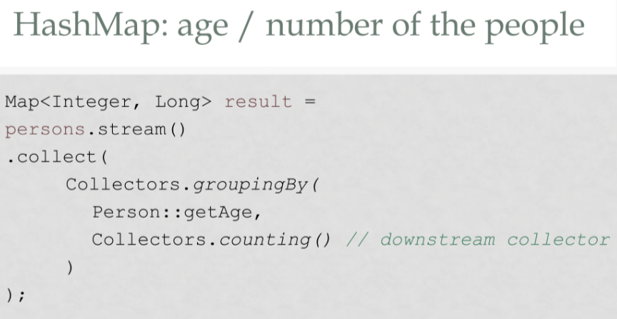
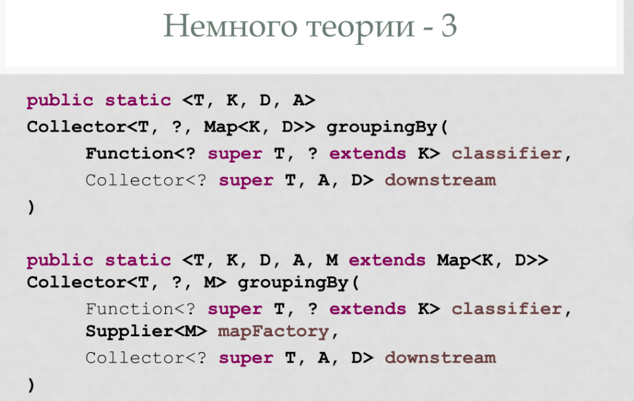

# Внутренние классы
### Мотивация:
* множественное наследование   
внутренние классы с точки зрения создателей должны решать именно эту проблему. 
> (Тизер к следующей лекции): представим, что хотим сделать множественное наследие. Не могу. Но могу сэмулировать   
```java
class A extends B, C
....
class A {
    class BA extends B{}
    class CA extends C{}
    }
```
> это композиция, но не совсем. из ВА можно гулять в СА и наоборот. У них есть разделяемое общее состояние, которое может храниться во внешнем классе.    
Для полиморфизма можно сделать toB и toC, но фактически наследоваться не будет.
А можно наследоваться от одного и того же класса неоднократно.

* нет ключевого слова fritnd, которое позволяло бы доавать внешним классам доступ к внутреннему содержимому, т.к. это потенциальная дыра к внутреннему состоянию    
альтернатива - pakage private, но это плохо,т.к. любой дурак может влезть в кишки

```Java
class A{
    class notStaticB{

    }
    static class StaticB{

    }
}
```
* static - nested вложенный класс (как в плюсах, но имеют доп возможности) 
* not static - inner - внутренний класс
* кроме этого мб 
## Общие вещи
### Компиляция 
в java каждому классу соответсвует свой class файл. Для внутреннего класса формируется отдельный файл (и для inner и для nested). Он не загрузится в машину, пока мы к нему не обратимся.

И inner и static по умолчанию friend, то есть имеют доступ ко всему содержимому А. Теперь радостно можно реализовывать итераторы.

### Наименование
class A ~ pakage_path.A
class B ~ pakage_path.A.B (либо статический импорт)

### Модификаторы доступа
* Зачем? Если снаружи захочу обратиться к классу A.B. Если сам класс private, то и все их штуки должны быть private (чтобы сохранять инкапсуляцию)
* скрыть поля от родительского класса нельзя: что в рамках одного файла сркывать нельзя. Разработчиками джава сичтается, что если это единый файл, то разработчик не дурак.

# Отличия inner  
### ССылка на родителя   
любой экземляр внутреннего класса неявно связан с экземпляром внешнего. Пример: итератор для коллекции итеррируется по конкретному экзкмпляры, поэтому здорово, когда мы связу к нему привязываемся.   
```Java
 this ~ B
A.this ~ A (внешний, привязанный)
A.this.x ~ x в А
x ~ сначала ищем в В, затем в А
```

* Как экземлпяр внутреннего класса привязать к внешнему?
```Java
\\Внешний код (или есть в А хотим привзяать другой B)
A a = ...
A.B y = a.new B(...);
\\Внутри А 
this.new B()
...
new B
```
* А где inner класс хранит ссылку на А? 
Хранит внутреннее поле. Конструктор класса В имеет неявным параметром ссылку на А.

### Нельзя делать статические поля/методы
Почему? В каком смысле статические? Непонятно
* Общее для всех экземпляров внешнего класса? прикольно, обещают реализовать
* Общее для всех экземпляров В?    

А что делать? Хотите статическое - выносите в А.

# Примеры
```Java
class Ex0{
    void bar(){}
    void foo(){}
    private class Test2 implements Iterator{
        void foo(){
            bar();
            Ex0.this.foo();
            Test2 a = new Ex0.this.new Test2();
        }
    }
    static private class Test2 implements Iterator{
    
        void foo(){
            Ex0 ex = new Ex0();
            ex.bar();
            ex.foo();
            Test2 a = new ex.new Test2();
        }
    }
}
```
Как используя вложенные классы реализовать ленивый синглтон? Хороший в некоторых случаях (многопоточно безопасная, т.к. ), но лучше через enum (но оно не ленивое). 
```Java
public class Ex{
    private Ex();

    private static class SiglHolder{
        public static Ex instance = new Ex();
    }

    public static Ex.getInstance()
}
```
--------
свойство                                | inner | nested
---                                     |---    |---
friend                                  |+      |+
привязан к экземпляру внешнего          |+      |-
можно делать статические поля и методы  |-      |+

# Локальные не локальные
В МЕТОДЕ И ЗАХВАТЫВАЕТ ЛОКАЛЬНЫЕ ПЕРЕМЕННЫЕ 

Написать внутри методов (может быть как вложенным, так и внутренним). Локальный класс - тоже класс, поэтому компилируется в отдельную сущность. Загружаются независимо от внешнего.

Его извне класса вообще не видно.

В чем отличие? Когда мы внутри локального класса - мы имеем еще и локальное окружение (переменные и т.д.), которые мы тоже можем использовать. Как
1. Запретить использовать
2. **Разрешить использовать** (так и сделали)   

Почему это плохо? Локальная переменная живет на стеке и когда стек заканчивается - она исчезает. Мы ведь можем вернуть экземпляр класса с мертвой переменной.   
Чтобы этого не было - переменную нужно захватить (замкнуть, **скопировать в кучу** класса переменную со стека или ссылку (объекты на стеке создавать мы не умеем, они всегда в куче)). Он делает это сам. Но что делать в тот момент, когда переменную i меняют?
1. Ничего
2. Как-то ссылаться и обновлять
3. **Запретить изменять захваченные переменные** (так и сделали)    
Значит, захватывать можно только final. Начиная с 8 Java final можно не писать, т.к. появилась effectivly final переменные (которые без ключевого слова final, но являются такими. это проверяется на этапе компиляции во всех возможных вариантах исполнения внешнего класса).

# Анонимные / не анонимные
Зачем они нужны? 
1. Сортировка
```java
interface Comparator;
class Comp implements CompInt<E>{
    compare(...){}
}
Comp x = new Comp();
Collection.sort(list, x);
```
Но каждый раз писать класс - утомительно. Анонимные классы позволяют делать следующее:
Comparator - это интерфейс, мы не можем создать экзепляр его, т.к. там лежать нереализованные методы. Поэтому реализуем их, не создавая явно класс

```java
Comparator<A> x
```

* Можно наследовать/реализовывать только 1 класс или интерфейс
* Я создаю его только 1 раз и работаю с ним только через интерфейс компаратора, т.е. делать в нем новые публичные методы 
* у него нет конструктора и нет имени ()

Нелокальный анонимный класс
private A x = new A(){};

Анонимных интерфейсов не бывает

* в чем особенности nested?

# Примеры
## 1. Фабричный метод / реализация по умолчанию
```java
interface Product{
    void foo();
}

abstract class Creator{
    public abstract Product getProduct(){
        return new C
    }
}
```

Паттерн Java : реализация по умолчанию (когда есть какой-то конкретный создатель-конструктор)

## 2. public Inner - тест для внешенго класса
Unit-test - тестирование интерфейса. Но хотим попроверять внутренние методы, поля. Есть reflection, через который можно посмотреть приватные поля. Но этот способ лучше: запускаем main во вложенном (nested, т.к. static). Который вызываем извне и умеет обращаться к приватным полям

Загрязняет код? Да, но это же отдельный класс. Когда отдадим это заказчику, то файл с классом inner удалим.

## 3. Интерфейс узла в односвязном списке
Интерфейс узла в односвязном списке. Последний элемент зацикливается сам на себя.
Внутри интерфейса создаю а?

какая-то штука, анонимная, вложенная, нелокальная 
не подходит если ноды изменяемые 

реализация без анонимная класса - закомментирована
вложенный, нелокальный, неанонимный

## 4. Selector
отличается от итератора тем, что у него есть метод next, **current**
Чтобы не париться с дженериками храним обжекты. 

внутренний - связываться с экземпляром
приватный - не хочу показывать имплементация


selector с точки зрения возвращаемого значения не sequenceselector, а просто selector. конкретная реализация скрыта и радостно инкапсулирована от внешенго мира.

Вариант 2: реализация через анонимный класс. Разница только в загроможденности кода.

## 5. Сортировка
нужно сделать компараторов

## 6. EventTest
Хочу захвативать переменные
length - поле внешнего класса, замыкать ее не нужно
n - локальная,effectivly finaly. Почему просто не написать i? Она меняется , ее изменять нельзя.
x - Integer - это ссылочный тип, захватывать ссылку ок

Вариант 2
i - замыкаем i, которая была передана как аргумент


# Что мы не обсудили?
1. Тизер на следующий раз   
Java 7 для соритровки переает компаратор и флаг, все реализуем ручками
Java 8
Добавили lambdas
Как? сделать как в 7 и добавить синт сахара. Поочему нельзя просто добавить лямбды?     
Потому что класс есть класс и каждый раз при использовании лямбды мы куд-то лезли, что-то подгружали, чтобы создать класс 1 раз и забыть    
МЕДЛЕННО    

Поэтому в 7 версию это не включили. Но сделали великолепный фреймворк.    

Чтобы стало хорошо - поменяли интерфейсы
* интерфейсы мб статик. тк нельзя было делать реализацию, а статические методы не вертуальные (должны быть реализованы)
* можно писать дефолт: реализовывать нестатические методы в интерфейсе, которые будут использоваться как реализации по умолчанию     
DEFAULT недоступна для equals, hashcode, toString  и т.д. Почему?    
```Java 
interface X{
    default equals()
}
class Foo implements X{
    //ожидаем при использовании X.equals
    //но это не так! упускаем неявно 
    //class Foo extends Object implements X
    //и побеждает реализация от object
}
```
Если метод в наследуемх интерфейсе и классе - побеждает метод из класса

## Функциональный интерфейс
* интерфейс с единственным **абстрактным** методом      
> если есть другие не абстрактные методы - то все равно функциональный
* можно пометить аннотацией @FunctionalInterface


Зачем? Для лямбды. Лямбдв в 8 java может заменять только функциональный интерфейс. Это показывает, что мы хотим реализовать ровно 1 метод. Поэтому удалось сделать их более быстрыми.


Интерфейсы 
- нельзя создавать протектед методы


Лямбда-функции - новый компактный синтаксис для функциональных интерфейсов - НЕТ! вранье из-за реализации

Лямбда-функция не класс (не имеет состояния). Можно **замыкать**, но только final и effectively final. Они хранятся на стеке, а мы делаем их копии в куче. 

Лямбда компилируется вместе с классом (лежит в его коде). Как работает?  В jmv добавили метод envolve dynamic. Вокруг нее создают "воображаемый класс"

Почему лямбду нельзя превратить в статические методы какого-то классы? Почти так и сделано, но эта конструкция виртуальная (т.к. нужно еще хранить замкнутые переменные). 

### Типы
 сама лямбда не имеет **типа** функционального интерфейса (здесь она справа) ```Function<String, String> f = s -> s + s;```

 Ссылка на метод - рассахаривается в лямбду
 ```integer::parseInt ~~ x -> Integer.parseInt(x);```

 Типа у лямбды нет - копилятор смотрт, куда мы этоо подставляем и вывыодит тип


-----------------------------------
```java
for(i...)
    n = i
    u -> ... n...
```
На каждый вызов лямбды будет создаваться своя сущность: по одной для каждого экземпляра i.

### Исключения
Лямбда не умеет работать с проверяемые исключениями. Внутри тела приведся писать ```try... catch...```

## Лябмда vs анонимный класс
1. не имеет внутреннего состояния => хорошо оптимизируются компилятором: почти чистые функции, хорошо инлайнятся. Поэтому внешние состояния неприятны
2. Имеет только 1 метод => хорошо оптимизируется
3. Отдельный механизм вызовов, который быстрее, чем у анонимного класса (спец инструкцияе в jvm)
4. Не правда, что лямбда **всегда** быстрее

----------------------------
стандартные лямбды дженерики => не параметризуются примитивными типами => для них есть специализации

# Stream
 методы стримов
 1. Порождающие 
 2. Конвейерные    
 все ленивые - не выполняют методов, пока не попросят ниже по потоку. Если после них стоят `;` (то есть терминальных методов нет), то метод вообще не запустится      
 все возвращают стрим (какой-то)    
 могут быть с **состоянием** - зависят от других элементов (sort, distinct)    
 
 3. Терминальные    
 сжимают все. могут вернуть стрим, но старый все равно пережуют


## Порождающие
1. из коллекции
2. из значений
3. из массива
4. из файла (строка - отдельный элемент)
5. из строки 
6. 
7. 
8. бесконечный: iterate - применяет функцию к стартовому значению и передает это дальше
9. бесконечный: generate - какой-то независимый производчик значений

Как сделать dictict по произвольному полю? Сделать свой  filtr с хеш таблицей 

## Конвейерные 
5. peek() Не терминальная!

## Терминальные 
1. findAny - удобен в параллельных стримах. Например, ищу доступный сервер из списка.

* редукции


# Редукция 
Свертка
1. `constructor: supplier` где брать контейнер для результата 
2. `accumulator: BiConsumer` func как добавлять элемент    
BiConsumer - принимает два элемента и ничего не возвращает. Это важно! Мы не создаем новый объект, а модифицируем существующий. Зачем? скорость
3. combiner: func  как объединять два частично заполненных контейнера 
4. `finicher<A, R>: Function` - что делать с готовым объектом
> обычно можно использовать готовые коллеткоры, которые отличаютяс только финишером. Н-р Collectors.joining(", ", "{", "}")

Как сделать это без коллектора?
ответ 1: добавлять открывающую скобку в констуркторе - плохо, т.к. конструктор может вызываться несколько раз многопоточно
ответ 2: использовать stringJoiner (еще есть StiringBuilder и StringBuffer)
Как сохранить порядок? Ordered

Collector<T, A, R>
T - элементы, которые умеет принимать
R - результат работы 
A - тип контейнера, в который все собирается. На него обычно плевать -> почти все методы с коллекторами <x, ?, y>

Пример 2: Как переписать это на ссылки на функции? Лучше через ссылки на Collection - так я могу легко менять реализацию, если изменю констурктор


Collectors.toList() -> ArrayList (но пишет, что просто List)
Collectors.

## Grouping by
Делает мапу, ключ - значение функции, результат - мапа с аргумнетами, которые соответсвуют этому результату
```
Map<
Integer
, List<Person>>
result
=
persons
.stream
()
.collect(
Collectors.
groupingBy
(Person
::
getAge
)
);

public
static
<T,
K>
Collector<T
, ?, Map<K, List<T>>>
groupingBy
(
Function
<?
super
T, ?
extends
K>
classifier
)
Returns
a Collector implementing a "group by"
operation on input elements of type T, grouping
elements according to a classification function, and
returning the results in a Map.
```
Результата - что-то, что можно привести к типу K

По дефолту значение в groupingBy - список из элементов. Можно обрабатывать иначе 


## 3  mapFactory 
собираем не в обычную мапу, а в конкретную 


counting считает количество в Long


TreeMap 

# Пример ГП

у нас есть файлик с гарри поттером. найти с помощью стримов 10 самый частых слов.

1. Реализовать с помощью стримов
2. Реализовать без помощь стримов
3. На след лекции реализуем 

```Java
\\читаем файлик
Files.lines(Paths.get("..."))
\\тут ошибку кинут lines  если что
    .flatMap(s -> Arrays.stream( s.split())) --stream слов
    \\на вход принимает s (строка в исхоной файле)
    \\разбивает их на слова и выдает стрим слов
    \\s.split -> arrays

    \\хотим посчитать частотность слов
    .collect(Collectors.groupingBy(
        Function.identity, Collections.counting))

    \\Теперь имеем мапу, а хотим стрим. у мапы его нет
        .entrySet().stream()
        .sorted(Comparator.comparing(Map.Entry::getValue))
        .limit(10)
        \\все еще стрим пар, но слова нужные
        .foreach(pair -> S.o.p(...))
```