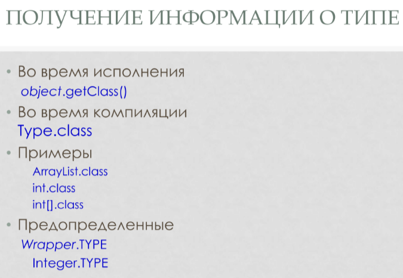
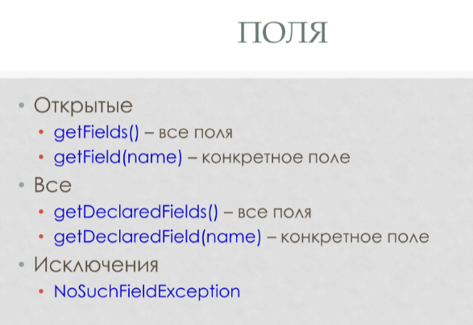
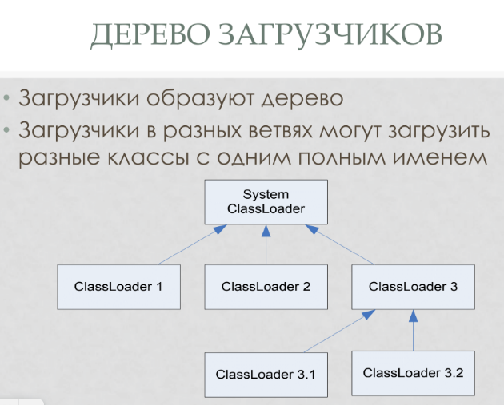
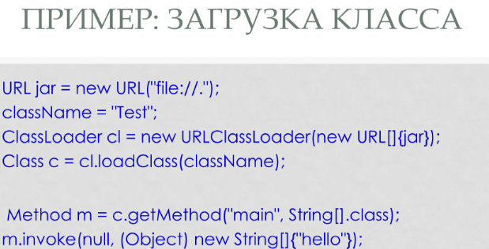
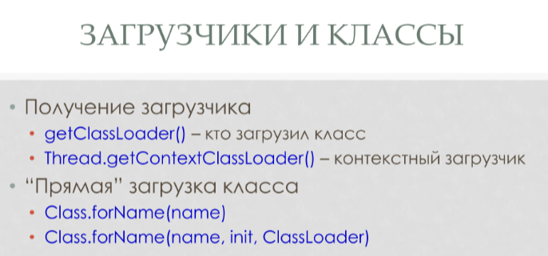

Позволяет оперировать информацией о типах во время выполнения программы (близкий родственник RTTI)

Класс `Class<T>` - сущность, которая хранит информацию о типе. T - конкретный тип, чаще всего ?
Внутри его можно получить иформацию рода: поля, методы и тд

Как получать информацию о типе? 
* Есть методы, которые можно вызвать в рантайме (именно класс объекта, не ссылки!)
* можно общаться с примитиввами


`Class.forName("name")`
позволяет загрузить класс, чье имя задано строкой.     
* Результат - информация о классе ииз exception(?)
* Насильно проводит статическую инициализацию. 

Во время компиляции такого класса мб вообще не быть. Зачем оно нужно? Например, для плагинов. В директории `plugins` лежат плагины, идем по их названиям и загружаем их по имени файла.

```Java 
Class<?> i = Init.class; 
//тут нет статической инициализации, мы знаем инфомрацию об этом класс в compile time
```

Name :
* canonical -> Java.lang.util.Map.Entry
* getName -> Entry
* Full -> Map.Entry 

x.getClass() == Derived.class   
можно через == т.к. информация о классе хранится как синглтон в permGen

------------------------
# Структура класса
ЧТО БЫВАЕТ ВНУТРИ КЛАССА • Members - Просто какие - то члены • Field – поля • Method – методы • Constructor – конструкторы • Class – вложенные классы
Аннотации
* лямбды - нет, не сущности
* блоки инициализации?

Что можно делать с мемберами? 


это еще не все! 


getFileds - все публичные поля класса или его родителей 

Открытые • getFields() – все поля • getField(name) – конкретное поле • Все • 
getDeclaredFields () – все поля (но не родие) • getDeclaredField(name ) – конкретное поле • Исключения • NoSuchFieldException

Возвращает описание поле - тип, имя. А еще он мембер (У кого есть мофификаторы, ласс, от которого он наследуется и т.д.)

поля имеют get, set(object, value) - в какой экземпляр кладем. У статических полей можно задать null
для примитивных полей stInt и т.д.
## Методы
• Открытые • getMethods() – все методы • getMethod(name, Class... parameters) – конкретный метод • Все • getDeclaredMethods () – все методы • getDeclaredMethod(name , Class... parameters ) – конкретный метод • Исключения • NoSuchMethodException

конструктор - не метод! 

А что с примитивными? Когда ищу метод - пищу int.class, когда invoke - Integer 

## КОНСТРУКТОРЫ 
###  Открытые 

* getConstructors() – все конструкторы (публичные, не родительские!) * getConstructor(Class... parameters) – конкретный конструктор • Все • getDeclaredConstructors () – все конструкторы • getDeclaredConstructor(Class... parameters ) – конкретный конструктор • Исключения • NoSuchMethodException

Теперь можно не только получить плагин по имени, но и загрузить его класс в рантайме! 


### ДОСТУП К ЗАКРЫТЫМ ЧЛЕНАМ 
• По умолчанию доступ к закрытым членам запрещен  IllegalAccessException • Все члены extends AccessibleObject • setAccessible ( boolean ) – запросить доступ, задает его для конкретного экземпляра поля (Filed) • isAccessible () – проверить доступ

```Java
Class<?> cl = c.getClass()
Field f = cl.getFiled(...)
f.setAccessible(true)
```

### ПРИМЕР: ЛИСТИНГ КЛАССА
```Java 

Class c =...;

for (Field m : c.getDeclaredFields()) {
    System.out.println(m);
}

for (Constructor m : c.getDeclaredConstructors()) {
    System.out.println(m);
}

for (Method m : c.getDeclaredMethods()) {
    System.out.println(m);
}
```
ПРИМЕР
:
СОЗДАНИЕ ЭКЗЕМПЛЯРА
//
Получение класса
Class
<Integer>
clazz = Integer.class;
//
Получение конструктора
Constructor
<Integer>
c = clazz.getConstructor(int.class);
//
Создание экземпляра
Integer i = (Integer) c.newInstance(100);
//
Проверка
System.out.println(i);


--------------
## Пример дз 

есть интерфейс
нужно нагенерить его реализацию
это все можно нагенерить из Field и Methid 
Едиснвтенная хитрость - нельзя делать пустые методы. Есть несколько вариантов.
1. Для примитивов: вернуть дефолтное значение. Как? Можно создать массив примитивного типа размера 1. В них кладут дефолтные значения!
----------------------

# ЗАГРУЗЧИКИ КЛАССОВ (класс ClassLoader)
 Позволяют загружать и определять новые классы   

Методы
* loadClass(name, resolve?) – загружает класс по имени
> resolve - нужно ли выполнять статическую инициализацию
* findLoadedClass(name)–найти уже загруженный класс
* resolveClass(class) – выполняет статическую инициализацию

ClassLoader'ы образуют иерархию (кто кого загружает)   


cl3.1  загрузи foo 
cl3.1 грузил foo? нет -> cl3 грузил foo?  нет -> System ClassLoader грузил foo? да ->верни класс,  нет -> cls3.1 грузит foo

зачем? чтобы загружать разные версии библиотек, или загружать из разных исчтоников 


как их использовать? создать экземпляр и делать через них loadClass 

при это loader может изменять содержимое подгружаемых классов

Класс хранит своего загрузчика

Потоку тоже можно задать своего лоадера

смотреть их можно так 

`init:: Bool`, делать ли статическую инициализацию 

Зачем глобально нужен рефлекшн? 

Получать доступ туда, где его нет

Зачем? 
* Тестирование
> можно делать внутренний/вложенный класс для тестирования, это лучше
* фреймворки
* `classLoader's` позволяют модифицировать байт код на лету 
> постоянно используется в фреймворках, например, `Spring injection` пишет аннотацию к полям, которые потом заполняются нужными значениями
>`lombok` - по дефолту в compile time, но можно и через `classLoader`

Почему плохо?
* не позволяет менять класс после загрузки
> но можно сделать `hotReload` (уберем его из ClassLoader'a)
* грязно, нарушение контрактов, нарушение констрактов
* очень медленно
* небезопасно: можем оптимизировать final параметры, которые всеми оптимизируются и никому мы не сообщаем, что мы их поменяли

