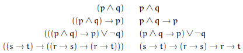

# Язык локиги высказываний
Матлогика изучает свойства формальных логических систем, т.е. искусственных языков

Подразделы:
* Теория моделей  
наделяет модели доп семантикой (лямбда исчисления могут вычислять что-то)
* Теория доказательств  
Правила перехода между высказываниями, их связь 
* *Теория множеств  
Как работать с бесконечными множествами? 
* Теория вычислимости  
Каким образом вводится понятие разрешимости, что вообще можно вычислить
* *Теория сложности вычислений  

Формальные логические системы:
* Логика высказываний  
* Логика предикатов первого порядка  
кванторы, под них - только базовые переменные множества (геометрия)
* Логики высших порядков  
кванторы, под них - можно предикаты и высказывания (матанализ, предел использует понятия последовательности или окрестности)
* Неклассические логики (темпоральные, модальные, индуцкионистские)

## Язык логики высказываний
Высказывания (propositions) нечто, о чем можно сказать истинно оно или ложно. Может быть невыводимо в текущей аксиоматике.  
 А может быть парадоксально (например, иметь ссылку на саму себя): "Высказывание во второй части этого предложения истинно, и высказывание в первой части этого предложения ложно."

Цель: запись однозначных высказываний на некотором
полностью формализованном языке. Этот язык называют
предметным или объектным.

Рассуждения об этих высказываниях ведутся на другом
языке, называемом метаязыком. Утверждения (на
метаязыке) о высказываниях называют метатеоремами.

Т.е. метаязык - язык, на котором мы рассуждаем о другом языке. 
## Формулы
Имеется бесконечный набор пропозициональных
переменных (высказываний):  
a, b, c, d, . . . , x, y, z, a1, a2, a3, . . .

Множество пропозициональных формул — это
минимальное (т.е. других использовать нельзя) множество со следующими свойствами:
* Всякая пропозициональная переменная есть формула;
* Если A — формула, то ¬A — формула;
* Если A и B — формулы, то (A ∧ B) — формула;
* Если A и B — формулы, то (A ∨ B) — формула;
* Если A и B — формулы, то (A → B) — формула
> скобки тоже часть синтаксиса, лишних писать нельзя

Пропозициональные связки -  символы ¬ (отрицание), ∧ (конъюнкция), ∨
(дизъюнкция) и → (импликация) 

## Свойства формул 
Доказательства свойств по индукции:
* база индукции: доказывают, что любая
пропозициональная переменная обладает данным
свойством;
* индукционный переход: доказывают, что если формулы
A и B обладают данным свойством, то все формулы (¬A,
(A ∧ B), (A ∨ B), (A → B)) тоже обладают данным
свойством.

Утверждение (доказываем по индукции). В любой пропозициональной формуле
число открывающих скобок равно числу закрываюших.

Утверждение (тоже по индукции). В любой пропозициональной формуле
число открывающих скобок равно числу бинарных связок.

## Приоритет и ассоциативность
* Задав приоритет и ассоциативность связок, можем
элиминировать часть скобок без потери однозначности.
* Приоритет (в порядке убывания): ¬ , ∧, ∨, →.
* Конъюнкцию и дизъюнкцию полагают
левоассоциативными, а импликацию —
правоассоциативной

# Семантика
Семантика связок - в чем их суть - задается таблицей истинности. Каждой составной формуле истинностное значение приписывают индуктивно, на основе таблиц истинности
для пропозициональных связок
## Булевы функции
* Если формула содержит n пропозициональных
переменных, то имеется $2^n$ различных возможных
наборов, значения на которых полностью определяют её
истинностное значение. 
* То есть формула определяет булеву функцию $B^n$ → B. Причем функция n-арная
* Если две формулы задают одну и ту же булеву функцию,
их называют эквивалентными.
* ?? Какая диаграмма Вена для импликации?
## Логические законы 
Формулы, истиннаые всегда (при всех оценках) - это:
* общезначимыми
* тавтологиями
* логическими законами

Формула выполнима, если существует оценка, на которой она истинна

Формула опровержима, если существует оценка, на которой она ложна

Формула невыполнима или противоречие, если не существует оценка, на которой она истинна

## Эквивалентность 
Это семантическое понятие. А датасаентичты хотят опреедять его синтаксически

...
Все тавталогии и противоречия эквивалентны друг другу (внутри класса), т.к. по сути кодирую константу
Формула А ↔ А ↔ А не тавтология. Расставим скобки. Если А - 0б то все ломается

нейтральные элементы
p ∨ 0 ↔ p
p ∧ 1 ↔ p
аннигиляторы
p ∨ 1 ↔ 1
p ∧ 0 ↔ 0
идемпотентность
p ∨ p ↔ p
p ∧ p ↔ p
(для импликации нет, там 1)
А что с импликацией?
истинна следует отгуда угодно, из лжи следует что угодно
p -> 1 ↔ 1
p -> 0 ↔ -p
0 -> p ↔ 1
1 -> p ↔ p 

## Законы
контрапозиции  ???

* закон исключеннного третьего: есть либо р, либо не р
* закон отрицания посылки
¬p → (p → q) = 1
если предполагаем отновременно, что р и не р, то из противоречия следует что угодно

* закон Пирса (тавтология)  
((p → q) → p) → p

В хаскеле такое не написать, тма инцианистская логика

*  (s → t) → (r → s) → r → t   
делаем анкари (s → t) and (r → s) → r → t  

## Логическое следствие 
Договорились, что часть формул истинна. Что можно из них вывести?

* Пусть имеется набор формул A1, A2, . . . , An.
* Формулу B называют логическим следствием этого
набора, если при любой оценке, для которой истинны
формулы A1, A2, . . . , An, истинна также и формула B,
нотация  
A1, A2, . . . , An |= B
* Символ |= задает отношение следования в метатеории и
читается как “влечет” (“влекут”). Похоже на выводимость из контекста
* Для обозначения того факта, что A — тавтология, часто
используют нотацию |= A.

Примеры.
p, p → q |= q
p |= p ∨ q
p 6|= p ∧ q

Теорема о логическом следствии. A1, A2, . . . , An |= B
тогда и только тогда, когда |= A1 ∧ A2 ∧ . . . ∧ An → B.

Т.е. должно быть влекомо из тавталогии

Скелет доказательства.
* A |= B тттк |= A → B. (для одной посылки доказываем, для двух и для n по иддукции)
* A1, A2, . . . , An |= B тттк |= A1 → A2 → . . . → An → B.
* Вызываем uncurry (из стрелочек делает пары).  

тттк - тогда и только тогда
# Булева Алгебра (для него нужжна формальная алгебра)