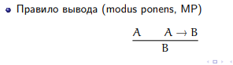
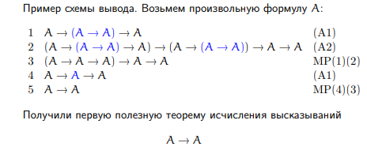

# Исчисление высказываний гильбертовского типа
# Классическое исчисление высказываний
* синтаксис: правила построения формул, 
* семантикаЖ значение переменных и функций по их таблице истинности
* теорема - то, что можно вывести из аксио по правилам вывода. Аксиомы именованые, выводы нумерованые

## 
схема аксиом: их много, но внутри они устроены одинаково (из формул). аксиомы - листья деревьев вывода (аксиомы) 
1. A → B → A
2. (A → B → C) → (A → B) → A → C
3. A ∧ B → A
4. A ∧ B → B
5. A → B → A ∧ B
6. A → A ∨ B
7. B → A ∨ B
8. (A → C) → (B → C) → A ∨ B → C
9. ¬A → A → B
10. (A → B) → (A → ¬B) → ¬A
11. A ∨ ¬A
1. К
2. S
3. fst
4. snd
5. пара
6. Either left
7. Either Right
8. either
9. neg
10. neg
11. правило исключенного третьего
## Правило вывода
сохраняет тавталогии. потом докажем, что выводимость и истинность в этой системе - это одно и то же

если есть

Теорема 1: из утверждение следует оно само. Доказательство

## Корректность исчисления высказываний
* Теорема - выводима из аксиом (синтаксис)
* Тавтология - имеет таблицу истинности (семантика)

### Теорема (soundness). 
Всякая теорема исчисления высказываний есть тавтология.

Доказательство.
Аксиомы являются тавтологиями (доказывается прямой
проверкой).
Правило MP тоже корректно: если A и A → B всегда
истинны, то B тоже всегда истинно.


## Лемма о дедукции
* Пусть Γ |- A → B. Тогда и Γ , A |- A → B, откуда из
Γ , A |- A по MP получаем искомый результат.
* Дано: Γ , A |- B.  Рассмотрим вывод формулы B —
последовательность формул
C1, C2, . . . , Cn
где Cn это B.
Ci может быть: 
1. A, (2) из Γ , (3) аксиомой, (4)
результатом применения MP к двум предыдущим Ck и
Ck → Ci.
Припишем ко всем формулам вывода посылку A
A → C1, A → C2, . . . , A → Cn
и покажем, что эту цепочку можно расширить до вывода.
1. Ci = A, в новой цепочке это будет A → A, это выводимое
утверждение, добавляем его вывод.
2. Ci ∈ Γ . Вставляем Ci и Ci → A → Ci (A1), MP даст
искомое A → Ci.
3. Ci — аксиома. Аналогично.
(4). Ci выводится по MP из предыдущих Ck и Ck → Ci. То
есть новой цепочке имеются A → Ck и A → Ck → Ci.
Вставляем формулы
(A → Ck → Ci) → (A → Ck) → A → Ci (A2)
(A → Ck) → A → Ci MP
A → Ci MP
##
|- А - А выводима из аксим (выводима только тавтология)

не помню откуда это
> иногда мы вводим доп формулы из предетной области. это могут быть не тавтологии а просто формулы, но мы добавляем их (например, что функция ассоциативна)

## Правило сечения
> Плохо, если выводим снизу вверх: А мы иссекли, а откуда его брать при выводе непонятно

**Теорема**. (Правило сечения.) Если Γ |- A и ∆, A |- B, то
Γ , ∆ |- B.

**Доказательство**. Расширяем первое до Γ , ∆ |- A. Расширяем
второе до Γ , ∆, A ` B, затем ко второму применяем лемму о
дедукции, получая Γ , ∆ ` A → B. Искомый результат
получается с помощью MP. 

# Правила естественного вывода
> Выводить все ручками из аксиом тяжело -> выведем вспомиогательные правила вывода из наших теорем

admissible - допустимы - требуют нетривиального преобразования доказательста

 derivable - выводимы - просто схлопывание части вывода mp

 ## а потом можно все аксиомы превратить в правила вывода
 ВЫВОДИМЫ ТОЛЬКО ТАВТОЛОГИИ

 отрицание - это частный случай импликации

 ## Аксиома 9 (аксиома о дряни)
 если мы можем доказать А и не А, то из этого можно доказать что угодно - набор Г протухший

 ## Аксиома 10
 Если набор Г нормальный, но при добвалении А можем вывести из нового набора В и не В, то из этого выводимо не А

  ## Как доказать не А?
  Добавим А в посылку и докажем от обратного (придем в противоречию не А). 
  в примере: из одного и того же набора посылок с А (1,4) вывели В и не В. Значит, А - тавтология.

  можно ли убрать аксиомы слева от правила вывода? Да, как и любую тавталогию (где-то кто-то доказал, что если убрать сечение, то можно доказать без него)