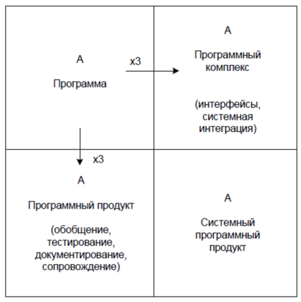
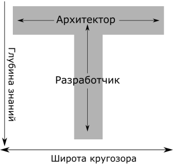
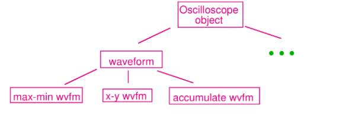
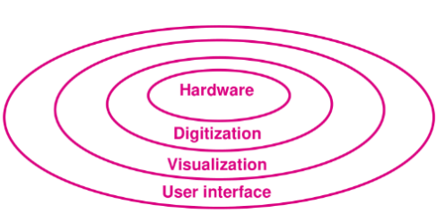
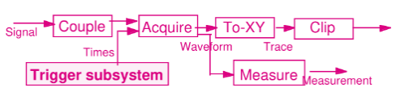
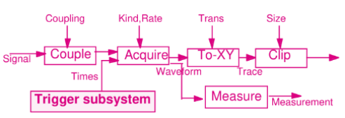

▶ Краткое описание деталей реализации в README (желательно с картинками)

Первую задачку удобнее писать на питоне

CI - github actions/travis/jenkins// лучше попробовать облачные, желательно, чтобы работали с github. деплоить вообще не надо, ci нужен чтобы проверять, что мы накодили

CI - проверяет целостность кодовой базы

# Архитектура
Деньги хотят платить за продукты, которые 
* работают у всех и на всех данных
* удовлетворяют не тз, а реадльным требованиям
* могут быть сопровождаемы
* документированы 

> программы работают только в окружении, поэтому реальную ценность имеет только СПП.   
Переход от левого верхнего квадрата стоит в 3 раза больше, чем он сам

ПО обычно очень большое. В этом курсе речь о курсах, которые имеют сотни тысяч строк кода

### Как с этим разбираться? Архитектурой
* 60-70 программная инженерия
* начало 90 архитектура ПО

Архитектура - молодая наука, поэтому есть разночтение в ее формулировке:
1. формальное описание ПО (сети петри)
2. набор знаний о том, как в принципе все работает (без деталей), используем это определение
3. Совокупность важнейших решений об организации программной системы
* Эволюционирующий свод знаний
* Разные точки зрения
* Разный уровень детализации

### Для чего?
* экономит время кодирования
*  База для реализации, «фундамент» системы
* Инструмент для оценки трудоёмкости и отслеживания прогресса (для ПМ)
* Средство обеспечения переиспользования
* Средство анализа системы ещё до того, как она реализована (деньги, сроки. для их определения уже дб архитектура (ее черновик, разбиение на компоненты (декомпозиция), что можно переиспользовать из открытого ПО)). Хорошие оценщики могут оценить пропускную способность и надежность систем.

## Архитектор 
 специально выделенный человек (или группа людей), отвечающий за:
* разработку и **описание** архитектуры системы
* *доведение* её до всех заинтересованных лиц
* контроль *реализации* архитектуры
* *поддержание* её актуального состояния по ходу разработки и сопровождения

### Трудовые функции архитектора (По профстандарту 06.003, 6 - должен иметь бакалаврское образование)
* Умение работать с требованиями (Выявление и согласование требований к программной системе с точки зрения архитектуры)
* Создавать свою архитектуру (Выбор и моделирование архитектурного решения для реализации программной системы)
* Написать о ней документы (Разработка разделов по архитектуре проектных и эксплуатационных документов программной системы)
* Тестирование (Контроль реализации и испытаний программной системы с точки зрения архитектуры)
* Сопровождение эксплуатации программной системы с точки зрения архитектуры
> ничего про кодирование, все завязано на общении и гуманитарности 

### Архитектор vs разработчик

* Широта знаний (как другие люди делают, что вообще бывает, как должна работать система, какой язык лучше выбрать)
* Коммуникационные навыки
* Часто архитектор играет роль разработчика и наоборот. Часто архитекторов в команде просто нет (дорого, заказчик за это не платит). Иногда архитектор пишет интерфейсы и юнит-тесты.
> "Архитектор в «башне из слоновой кости» — это плохо", т.е. ???

## Пример: ПО для осциллографа
1. Варинат объектная модель (структура системы)

Здорово, но не сопровождаемо: никаких ограничений на объекты нет, каждый мб всязан с каждым
2. Вариант 2: слоистая архитектура (структура системы)

Слоям нижнего уровня нельзя обращаться к слоям внешнего

Проблема: настроки пользователя могут менять настройки на нижнем уровне => запросы все равно идут в обе стороны => каша из объектов

3. Вариант 3: каналы и фильтры (выполнение )
Рассмотрим преобразования сигнала как преобразования, выполняемые объектом 

Красиво, т.к. отчасти повторяет архитектуру физическую

Нельзя передавать данные от пользователя

4. Вариант 4: модифицированные каналы и фильтры 

Два типа каналов: от пользователя и обычные

Похоже на ююниксовые пайпы и микроархитектуру

## Выводы
* Можем делать утверждения о свойствах системы, базируясь на
её структурных свойствах
▶ Не написав ни строчки кода и даже не выбрав язык реализации
▶ Рассуждения очень субъективны
▶ Многое зависит от интуиции и вкуса архитектора, однако ошибки
очень дороги
▶ Можно выделить архитектурные стили — «архитектуры
архитектур»
▶ Можно выделить архитектурные точки зрения и архитектурные
виды (мапятся на визуальные яхыки)
▶ Разный уровень детализации

## Архитектурные виды
Стандарт IEEE 1016-2009
▶ Контекст — фиксирует окружение системы
▶ Композиция — описывает крупные части системы и их
предназначение
▶ Логическая структура — структура системы в терминах классов,
интерфейсов и отношений между ними
▶ Зависимости — определяет связи по данным между элементами
▶ Информационная структура — определяет персистентные
данные в системе
▶ Использование шаблонов — документирование использования
локальных паттернов проектирования
▶ Интерфейсы — специфицирует информацию о внешних и
внутренних интерфейсах
▶ Структура системы — рекурсивное описание внутренней
структуры компонентов системы
▶ Взаимодействия — описывает взаимодействие между
сущностями
▶ Динамика состояний — описание состояний и правил
переходов между состояниями
▶ Алгоритмы — описывает в деталях поведение каждой сущности
▶ Ресурсы — описывает использование внешних ресурсов

### визульаные языки
как правило, для каджого вида свой. у хорошей архитектуры должны быть описаны почти все виды

* кавычки образуют один аргумент у команды
* одинарные не подставляются (считается литеральной строкой, выводим как есть)
* двойные подставляются (подсьавляем приколы из переменного окружения)
* заносить в переменную окружения (в рамках сессии, если вызываем из шелла другое приложение - передаем ему. можно использовать system env)
* вызов внешней программы (path), некоторые яп имеют инструменты, которые сами ищут в патн приложения и выполняют
* пайплайны (передача выдачи одной команды в другую, можно не многопоточную)
* многострочный ввод и управление потоком управления, что бы это ни было, не нужно
* ? автомат из 4 состояний, который парсит строчку
* можно так: все, что слева от равно - символы переменной, все что справа - ее значение 
* подстановку можно только $
* эскейп символы не нужны даже для кавычек (можно как бонус)

* последний пример на строке 4 должен завершать работу баша
* wc мб зависеть от системы
* реализация должна работать кроссплатформенно (многие проверяющие будут смотреть под виндой)
* реализации будет две: сначала без пайпов, потом с пайпами
* проектировать поиском в ширину
2-3 страницы 

* модель данных (что на выходе у парсера)
* нужно ли иметь фабрику команд, как они будут вызываться 
* когда выполняются подстановки, что раньше - подстановка или разбинеие на токены, правильно по
* обработка ошибок, прервать пайп
* подробнее рассказать про интерфейс функций (не путать параметры и stdin)