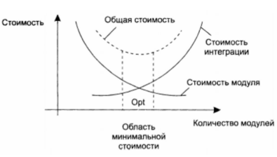

# Лекция 2: Декомпозиция, объектно-ориентированное проектирование
Свойства сложных систем
* Иерархичность — свойство системы состоять из иерархии
подсистем или компонентов
> Декомпозиция - делим на подзадачи до тех пор, пока не знаем как их решать
* Наличие относительно небольшого количества видов
компонентов, экземпляры которых сложно связаны друг с
другом
> Выделение общих свойств компонентов (типов), абстрагирование
* Сложная система, как правило, является результатом эволюции
простой системы
* Сложность вполне может превосходить человеческие
интеллектуальные возможности
## Подходы к декомпозиции
### Восходящее проектирование
> Сначала создаём “кирпичики”, потом собираем из них всё более
сложные системы. Например, создание библиотек/фреймворков, TDD
### Нисходящее проектирование
* Постепенная реализация модулей
* Строгое задание интерфейсов
* Активное использование “заглушек” (н-р undefined)
* Модули:
1. Четкая декомпозиция
2. Минимизация интерфейса
3. **Принцип единственности ответсветнности**: Один модуль — одна функциональность
4. Отсутствие побочных эффектов
5. Независимость от других модулей
6. Принцип сокрытия данных
8. Строгое определение контрактов позволяет разрабатывать
независимо
9. Необходим баланс между количеством и размером модулей. Маленькие модули проще поддерживать, но время работы выше.

* **Сопряжение** (Coupling) — мера того, насколько
взаимозависимы разные модули в программе (сколько вызовов другого модуля идет из текущего)
* **Связность** (Cohesion) — степень, в которой задачи,
выполняемые одним модулем, связаны друг с другом (насколько функции похожи друг на друга семантически). Считать ее можно, но бесполезно.

* Цель: слабое сопряжение и сильная связность

## Объекты 
Объект - это не всегда экземпляр класса (на js это не так, на python почти не так).
* объект - некоторый независимый исполнитель
* у объектов есть полиморфизм
### Имеют 
* состояние, инварианты (условия, которые сохранены на всем времени жизни объекта)
* поведение 
* идентичность, эквивалентность между объектами (важно, когда объект сериализуется-десериализуется, иначе он определяется своим местом в памяти)
### Взаимодействие
* контрактное программирование: взаимодействие через посылку и приём сообщений, в теории методы друг друга не вызываются (или в языке Eiffel)
* Объект вправе сам решить, как обработать вызов метода
(полиморфизм)
* Могут существовать в разных потоках
#### Как правило, являются экземплярами классов
> класс ~ тип объекта
## Абстракция
Абстракция выделяет существенные характеристики объекта,
отличающие его от остальных объектов, с точки зрения наблюдателя
> Это не ООП специфика, а математический и философский термин. Доказывать теорему - это как пистаь программу, которая работает для интрефейса (Математическогго класса)
## Инкапсуляция (???)
* Инкапсуляция разделяет интерфейс (контракты) абстракции и её
реализацию
* Инкапсуляция защищает инварианты абстракции

Иногда в нее включают **сокрытие деталей реализации**
## Наследование
Отношение над типами
* Отношение “Является” (is-a) принцип подстановки Лисков
>в с++ не работает, т.к. есть приватное наследование
* Способ абстрагирования и классификации
* Средство обеспечения полиморфизма
* фиксировано во время компиляции
* хорошо представляет иерархические структуры 
## Композиция
* Отношение “Имеет” (has-a)
* Способ создания динамических связей (во время исполнения)
* Средство обеспечения делегирования
## Более-менее взаимозаменяемы
* Объект-потомок на самом деле включает в себя объект-предок
* Композиция обычно предпочтительнее

trate ~ mixin classes

## Источники объектов и асбтракций
1. Сущности реального мира
2. Изоляция сложности
>сложность может протекаеть через интерфейсы (перекладывать много решений на пользоватеоля)
3. Изоляция возможных изменений 
## SOLID
> Вопрос на вынос на экзамене: сколько принципов вспомните без расшифровки - такая максимльная оценка
### Single responsibility principle
* Каждый объект должен иметь одну обязанность
* Эта обязанность должна быть полностью инкапсулирована в
объект (т.е. разные классф не должны делать одно и тоже. иначе непонятно, где искать ошибки)
### Open/closed principle
 Программные сущности (классы, модули, функции и т. п.)
должны быть открыты для расширения, но закрыты для
изменения
* Переиспользование через наследование
* Неизменные интерфейсы
> суть: если уже опубликовали класс и им кто-то ползуется, то изменять его уже не нужно. нужно заранее продумывать точки расширения (что-то вроде паттерна стратегия)
### Liskov substitution principle
* Функции, которые используют базовый тип, должны иметь
возможность использовать подтипы базового типа, не зная об
этом
> непонятно, что делать с исключениями (java)
> наличие доп инварианта могут сломать все: можем менять ширину у прямоугольника, но у квадрата - нет, его инварианты портятся

### Dependency inversion principle
▶ Модули верхних уровней не должны зависеть от модулей
нижних уровней. Оба типа модулей должны зависеть от
абстракций
▶ Абстракции не должны зависеть от деталей. Детали должны
зависеть от абстракций

что такое верхний уроыень? 

разрываем прямую связь: выключатель дергает не лампочтку, а что-то свитчабл

давайте не будем напрямую использовать тип, а только интерфейс
### Закон Деметры
не стоит ссылаться на поля полей
исключение: linq(?), когда каждый метод возвращает this 
> book.pages().last().text()

# CLI
maven проекты быстрее загружаются (просто парсят xml), в gradle нужно подгружать что-то там, что долго

auto fin = vect.size() - 1;
for(size_t i = 0; i <= fin; i++){
    if(vect[i] % 2 == 0){
        swap(vect[i], vect[fin]);
        fin--;
        i--;
    }
}
vect.erase(vect.begin(), vect.begin() + fin);