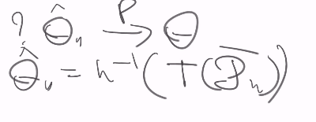

 ## оценка параметров
 наша предположение заключается в том, что распределение не какое-то, а определенное 

оценка - любая функция от выборки, которую можно вычслить

Свойства хороших оценок
1. О п р е д е л е н и е 3. Статистика θ∗ = θ∗
(X1, . . . , Xn) называется несмещённой оценкой параметра θ, если Eθ
∗ = θ.

θ∗ - это измеримая функция от выборки (точнее, семейство функций т.к. мы должны уметь подставить выборку любого объема)-> это с.в., распределение её Q зависит от параметра => распределение θ∗ - это какая-то функция от θ

фактически несмещенная оценка - черный ящик, куда кладем выборку и получаем среднюю несмещенную оценку

## Способы построения оценок 
### 1. **Метод выборочных характеристик (метод моментов, метод подстановки: заменяем генеральное распределение на эмпирическое)**

Пусть есть характеристика: выражение, которое на вход берет выражение и на выходе возвращает что-то T:П -Ю R
$T(R_{th}) = h(th) => th = h^(-1)(T(?))$
h(th)  - генеральная характеристика - функция от тета, эесли обратима - можем вытащит тету

заменяем наше измерение на эмпирическое

? почему функция ошибок обратима? т.е. существует единственное решение уравнения

? даже если уарвнение формально разрешима и можем посчитать Th', то не факт, что оно входит в тета большое

генеральная характристика под названием дисперсия - это O(1-O)

П($\lambda$) - распределение пуассона с параметром лямбда. его среднее и дисперсия совпадают

Свойства оценок, построенных методов моментов
1. Смещены (обычно)
2. Состоятельны (часто)

В каких условиях O' ->P O (сходится по вероятности)

ограничения:
* нужно, чтобы выборочная характеристика была состоятельной оцнекой генеральной, дает сходимость по вероятности

* jобратное отображение дб непрерывным

подставляем в сходимость по вероятности во время непрерывных преобразований
