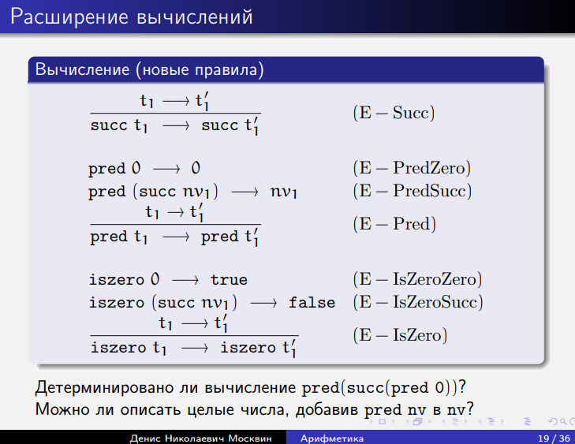
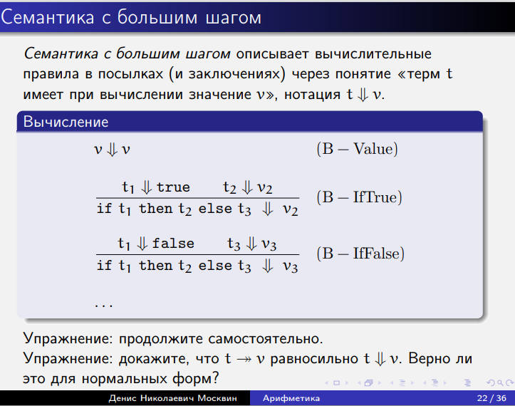
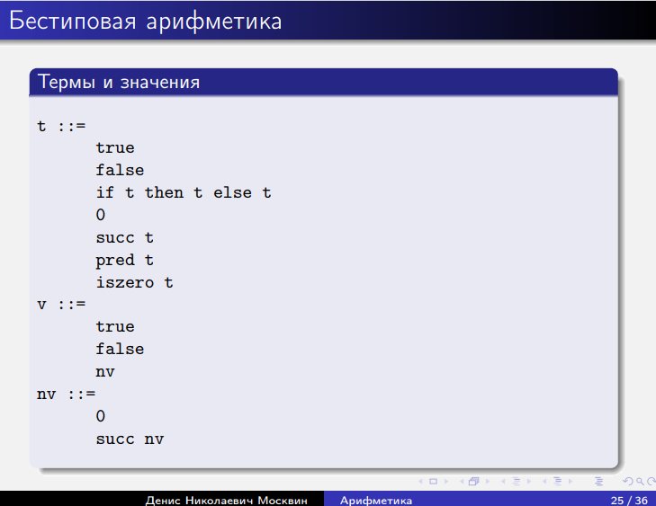
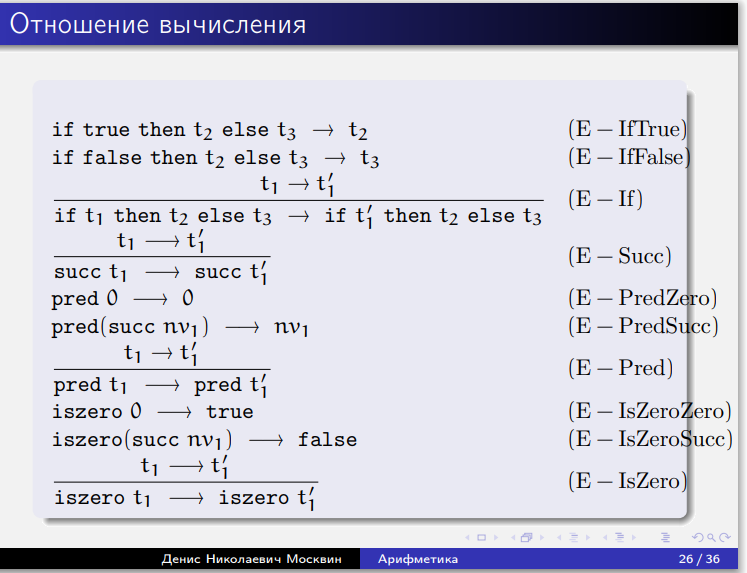
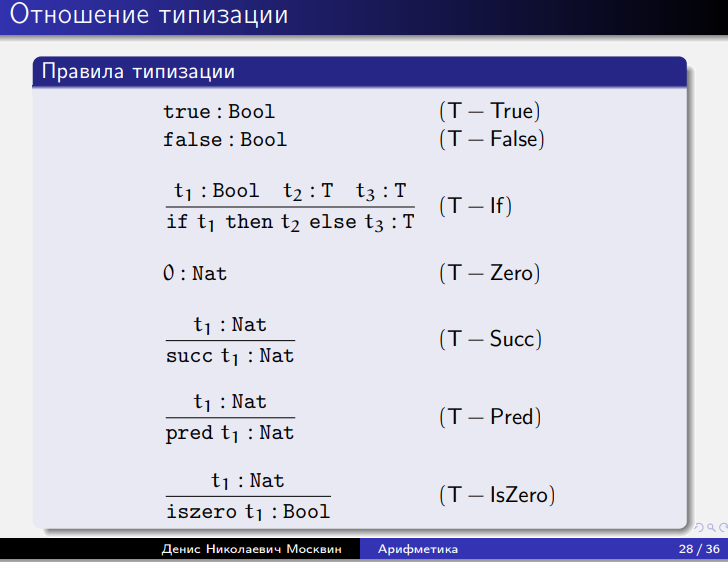
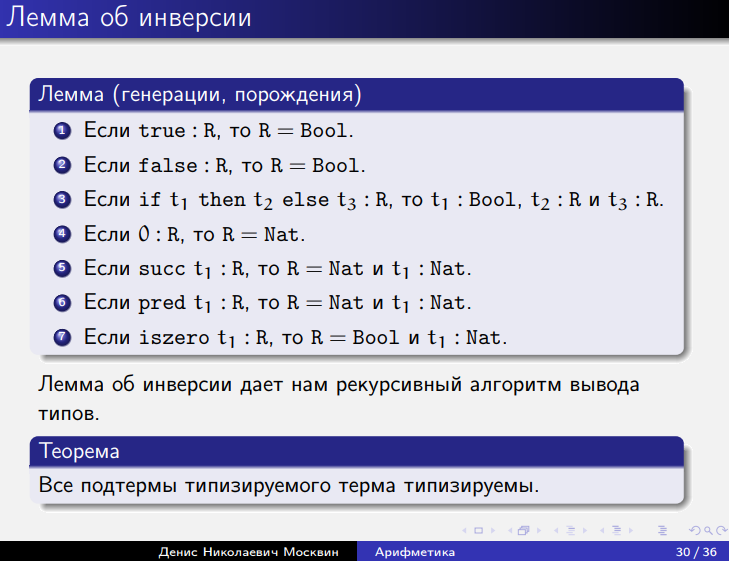

# Лекция 1. Язык арифметических выражений
> типы не работают вне языка, поэтому придумаем его
1 Отношение вычисления
2 Бестиповая арифметика
3 Арифметика с типами
## 1 Отношение вычисления
Термы исчисления
Грамматика в стандартной форме **Бэкуса-Наура**:
Термы (выражения) исчисления
```python
t ::=
    true
    false
    if t then t else t
    0
    succ t
    pred t
    iszero t
```
Здесь t — метапеременная; справа описываются допустимые
синтаксические конструкции. Все символы (t, succ, pred) делятся на терминальные (для которых нет правил) и нетерминальные (имеющие правила). Здесь правило одно: терм t - это

Можно описать и индуктивно, и в виде схем правил вывода, и в
виде конкретной иерархии

Термы, индуктивно
Множество термов T — это наименьшее множество,
обладающее следующими свойствами:
```python
{true, false, 0} ⊂ T -- терминалы, посылок для заключения не нужно
t ∈ T ⇒ {succ t, pred t, iszero t} ⊂ T -- нетерминалы, выводими из предпоылок 
t1, t2, t3 ∈ T ⇒ if t1 then t2 else t3 ∈ T
```
Почему мы не говорим о скобках, хотя, вроде, надо бы?

Мы определяем термы как деревья в **абстрактном** синтаксисе.
При записи в линейном, строковом виде используем
группирующие скобки. В конкретном синтаксисе пришлось бы указывать.

A1...An / B : Ai - посылки, В - вывод. в дереве вывода
### Термы исчисления, конкретно
Конкретная иерархия, индукция по глубине
```python
T0 = ∅
Ti+1 = {true, false, 0} --Т1, 3 элемента
∪ {succ t, pred t, iszero t | t ∈ Ti} --Т2, 3 + 3*3 элементов, второй уровень
∪ {if t1 then t2 else t3 | t1, t2, t3 ∈ Ti} --Т3, 3 + 3*3 + 27 элементов,
T = Ui Ti
```
Является ли эта иерархия кумулятивной? Да, приавляем к текущей термы из предыдущего слоя. Удобно для рассуждений 
> задава констуркции можем доказывать для них свойства
### Индукция на термах
**Индуктивное определение** множества констант терма:
Определение
```
cnst(true) = {true}
cnst(false) = {false}
cnst(0) = {0}
cnst(succ t) = cnst(t)
cnst(pred t) = cnst(t)
cnst(iszero t) = cnst(t)
cnst(if t1 then t2 else t3) = cnst(t1) ∪ cnst(t2) ∪ cnst(t3)
```
каждый способ задать терм - это констурктор, константа - true, false, 0

Как хранить множество? Ассоциативным списком? 
### Индуктивное доказательство
**Принцип структурной индукции** (можно посмотреть у Пирса)  
Если из того, что свойство выполнено для всех
непосредственных подтермов данного терма выводимо, что
свойство выполнено для данного терма, то свойство верно для
любого терма.

size (количество узлов всех типов) и depth
(глубина дерева).

**Лемма**
```
∀t |cnst(t)| <= size(t)
```
Доказываем структурной индукцией, перебирая всевозможные
синтаксические формы.
Можно доказывать и индукцией по глубине и по размеру.

### Семантические стили
терм pred(suc(o))
* **Операционная семантика:** описываем абстрактную
машину. Для простых языков состояние это терм, а
поведение задается функцией перехода, которая либо
описывает следующее состояние, либо говорит, что
достигнуто конечное состояние. Смысл терма — его
конечное состояние.
> задаем правила, как вычислять конструкции (правила редукции) . смысл терма - ег конечное состояние/задаем правила, что pred сокращается с suc

* **Денотационная семантика:** смысл терма — некоторый
математический объект из семантического домена. Для
каждого терма задается функция интерпретации.
>отобразим в какую-то область, например в целые числа / pred это -1, suc +1

### Операционная семантика для булева подмножества
Для того, чтобы описать процесс вычисления, надо
задать подмножество термов, называемых значениями;
задать отношение вычисления за один шаг : t → t
0
.
На булевом подмножестве
**Термы и значения**
t ::=
true
false
if t then t else t
v ::=
true
false
Здесь t и v описывают синтаксические категории, нетерминалы

> посему в t повторяем true, false? для красоты. разницы нет
### Отношение вычисления на булевом подмножестве
стрелка - переход, вычисление  t1-> t2 значит, что t1 вычисялется в t2 через 1 шаг
**Вычисление в нашей системе (1 шаг)**
```
if true then t2 else t3 → t2 (E − IfT)
if false then t2 else t3 → t3 (E − IfF)
t1 → t
0
1
if t1 then t2 else t3 → if t
0
1
then t2 else t3
(E − If)
```

 t2, t3 вообще не важны для вычислений, а t1 - важен. здесь может быть 1 из вариантов (по определению t)им соответсвуют варианты вычислений 

Как будет вычисляться следующее выражение?
if true then (if false then false else false) else true
Можно построить дерево вывода для вычислений: листья —
рабочие правила (computation rules): (E − If) и (E − IfF), узлы
— правила соответствия (congruence rules): (E − If).
Ветвлений нет (нет бинарных узлов, либо 0 либо 1)! Дерево-пальма :)

наш язык всегда останавливается либо в true, либо в false
### Детерминированность нашего одношагового вычисления
Теорема (только про нашу стрелочку)
```
Если t → t' и t → t'', то t' = t''
```
Доказательство: индукция по дереву вывода для вычисления
t → t
0
. Смотрим в корень, разбираем возможные варианты
структуры t, исходя из последнего правила, затем сравниваем с
деревом для t → t
00
.
(E − IfT): t = if t1 then t2 else t3 и t1 = true. В дереве
вывода для t → t
00 не может быть другого правила.
(E − IfF): аналогично.
(E − If): аналогично, с использованием IH.

### Нормальная форма
* **Определение**
Если к терму неприменимо ни одно вычислительное правило,
то говорят, что он находится в нормальной форме.
* **Теорема**
Любое значение (v) является нормальной формой.
* **Теорема**
Если t — нормальная форма, то t является значением.   
Доказательство: пусть t не значение, докажем, что не NF,
структурной индукцией. «Не значение» должно иметь вид
if t1 then t2 else t3. t1 = false или t1 = true — не NF, в
третьем случае пользуемся IH. 

Второе утверждение верно только для нашего простого
исчисления, первое должно выполнятся для любого разумного.

НФ получаются в результате вычисления правил и не совсем зависят от нас. значения мы определяем ручками
### Многошаговое вычисление
Определение
Отношение многошагового вычисления t  t
0 — это
рефлексивно-транзитивное замыкание отношения
(одношагового) вычисления.
Теорема (единственность нормальной формы)
Если u и v — нормальные формы, и t  u и t  v, то u = v.
Доказательство: следует из детерминированности
одношагового вычисления. 
>рефлексивное позволяет включить 0 шагов

### Завершимость вычисления
Теорема
Для каждого терма t существует нормальная форма t
0
такая,
что t  t
0
.
Доказательство: На каждом шаге вычисления размер терма
сокращается. ВВодим метрику, которая при исчислении уменьшается. 
(Эта теорема верна только для ограниченного круга
исчислений.)

### Упражнение
Добавим в отношение вычисления еще одно правило
соответствия.
Вычисление
. . .
t2 → t
0
2
if t1 then t2 else t3 → if t1 then t
0
2
else t3
(E − Funny2)

Как это повлияет на приведенные выше теоремы?
* появялется недетерминированность (можем применить два правила, непонятно какое выбрать). Можно задать приориетте, но тогда сложно доказыавть свойства системы (доказать семантически)
* Все теоремы будут выполняться, кроме детерминированности
одношагового вычисления.
Пирс (Упражнение 3.5.13 (2)) утверждает в ответах, что для
получившегося исчисления будет верно свойство ромба с
одношаговым ребром.
* Покажите, что это не так. 
## Бестиповая арифметика
расширим вычисление булевых значений на арифметику
### Расширение до арифметики
Термы и значения
```
t ::= ...
0
succ t
pred t
iszero t
v ::= ...
nv
nv ::=
0
succ nv
```
Введена **синтаксическая категория** числовых значений nv (т.к. чисел бесконечно много).

можно ввести pred, но тогда придется вводить отрицательные и положительные числа и свойства для них


получили разделение
succ, pred - конструкторы
issero - функции

сгнм - не редекс на верхнем уровне ~ конструктор на верхнем уровне. лямбда на самом деле - это тоже конструктор, только для функции

гнф - артефакт лямбда-исчисления, которая требует искать головную позицию

### Детерминированность одношагового вычисления
Для нашей расширенной системы по-прежнему верна теорема о
детерминированности вычислений. 

**Теорема**
Если t −→ t' и t −→ t'', то t' = t''
* Можно расширить вычисления для многошаговых и ввести
понятие нормальной формы.
* Верна ли теорема о завершимости? Да, т.к. все вычислительные правила сокращают размер терма
* Верна ли теорема о том, всякая нормальная форма
является значением? Нет! pred false

### Тупиковое состояние
**Определение** Терм называется тупиковым (stuck), если он находится в
нормальной форме, но не является значением. Мы просто не можем придумать содержательного вычисление.
```
Пример тупикового терма
succ true
```
Для нашей абстрактной машины тупиковое состояние это
ошибка времени исполнения. Чтобы ее побороть введем систему типов.

 
почти не нужно, пирс использует, чтобы рассказать про джаву

## Арифметика с типами

здвесь видно, почему нужно дублироавть  true и false:в t nv включать не совсем корректно


будем потом дополнять этим лямбда-исчисление

## Тип ы
У нас имелись тупиковые термы, вроде pred(false).
Хотелось бы иметь возможность *статически* проверять,
зайдет ли вычисление в тупик.
Типы позволят это сделать, но консервативно, то есть
отбросив при этом и некоторые нетупиковые, например
if true then 0 else false. -- оно не тупиковое, но полиморфное
Введем новые синтаксические формы
Типы
T ::=
Bool
Nat

### Отношение типизациии -
 бинаное отношение, слева - терм, справа - тип (т.е. над разными множествами)
Определение
Отношение типизации (typing relation) для арифметических
выражений — это наименьшее бинарное отношение между
термами и типами, удовлетворяющее всем правилам с
предыдущего слайда.
Определение
Терм t называется типизируемым (typable) (или корректно
типизированным, well-typed), если существует тип T такой,
что t : T (такой, что его можно приписать)



Как читать правила типизации снизу вверх? (выводить посылки) в нашей системе верно, так как вссе наши выводы только в 1 правиле. 
syntecsys directed - по синтаксиеской структуре терма сразу понятно, какое правило было примененено


могут ли бвть нетипизируемые поддермы? в более сложных системах  $K\Omega I$

### Дерево вывода типа
Правила типизации позволяют строить дерево вывода типа.
Докажем, например, что
if iszero 0 then 0 else pred 0 : Nat.

строим, используе леммы генерации. это хорошо, т.к. у нас только 1 тип

### Единственность типа
Теорема о единственности типа
Всякий терм t имеет не более одного типа. Если терм
типизируем, то его тип выводится с использованием правил
типизации единственным образом.
Доказательство: Cтруктурная индукция по t, с использованием
леммы генерации. 
Это свойство выполняется далеко не для всех систем.

Черчевская система - та, которую снабдлии информацией о типе так, чтобы однозначно строить дерево.

В более богатых - записываем в терм минимальное число типовой информации, чтобы вывод был однозначен. пример, изорекурсивные типы. кариевская система - эквирекурсивные.

### Корректность типа (типобезопасность)
Безопасность = продвижение + сохранение (Харпер)

* Продвижение: Правильно типизированный терм не может
быть тупиковым (либо это значение, либо может быть
проделан следующий шаг в соответствии с правилами
вычисления).
* Сохранение (типа при вычислении): Если над правильно типизированным термом
выполнить шаг вычисления, то получившийся терм также
правильно типизирован. 

> Второе свойство почти всегда можно сформулировать более
сильным образом — тип сохраняется при вычислениях. В семантике с малым шагом иногда тип не сохраняется.

харпер считаем правильные ocaml и oml и пишет хорошие книжки, имеет целостное мировоззрение. совершенно безумный человек, ненавидит хаскель.

для чего даются определения? чтобы удобно развивать какую-то теорию, термины задают каку-то базовую теорию

### Канонические формы
Канонические формы (canonical forms) для некоторого типа
— это корректно типизированные значения этого типа.
Например, без правила (E-PredZero) у нас имелась бы
(корректно типизированная) нормальная форма pred 0, не
являющаяся значением.
Лемма о канонических формах
1. Если v — значение типа Bool, то v равно либо true, либо
false.
2. Если v — значение типа Nat, то v является числовым
значением.
Доказательство:
1. Значения — это true, false, 0 или succ nv. Первые два дают
искомые КФ, а вторые два имеют тип Nat.
2. Самостоятельно. 
