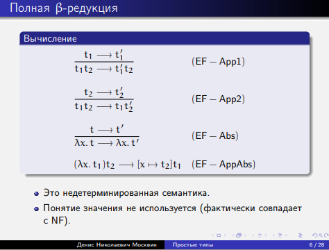
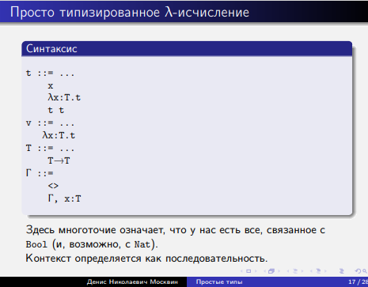

# 4
что-то про головную форму
* ЗНАЧЕНИЕ - это только лямбда-абстракция 
# Вычисление (5)
вычисляется только аппликация 
* App1,2- есть вычисление - проводи (в правом только есть )
*  AppAbs видишь лямбду - сокращай (перед тем, как подставляем - вычисляем)
* Есть ли тупиковые термы? Переменная, аппликация переменных

* пользователь работает только с замкнутым выражением (комбинатором)
## Простейшая операционная семантика(5)
заканчиваются, когда на верхнем уровне не редекс
## Полная β-редукция
описывает правила вычисления 

## 
* редукция до нормальной формы
* nanf - нормальная форма, которая не лямбда. в голове - переменная
> $\lambda$ ... x $M_1 ... M_k$

## Аппликативный - то же самое, но перед подстановкой в редукцию - сократи аргумент

# Как кодировать
> в прошлом году делали именовано, что содержало 1 червоточину : переимнование во избежании захвата переменных. Из-за вложенности областей видимости переменные с одинаковым именем могут иметь разные значения. Это может привести к коллизиям. Хочется избавитьяс от именованых переменных
### Биндеры
1. $\exists \alpha .~...$
2. $\forall \alpha .~...$
3. $\lambda x .~...$
# Де Брёйн
"индексов назад" не в плане налево а в плане по дереву 
> упражненеи: расписать стандартные комбинаторы

* свободные переменные  как будто "замкаем" выше. Это как бы контекст

ТЕРМ = ПЕРЕМЕННАЯ / АППЛИКАЦИЯ / АБСТРАКЦИЯ

* Когда проносим N под лямбду - нужно увеличить индексы на k (через сколько лямбд проносим), но не у всех, у локальных в N yt ye;yj

# Просто типизированное лямбда-исчисление

стрелки только между типами, поэтому между переменными не ставим ( только между булами и натами)

будем делать черчевские (у лямбд приписываем их тип) системы, там много типовых подсказок 

* задаем контекст как последоваиельность (т.е. тип мб важен)

Лемма о продживении: говрит, что тупиковых термов нет

t as T = (lx:T.x)t
t as T -> t' = (lx:T,y:T->t')