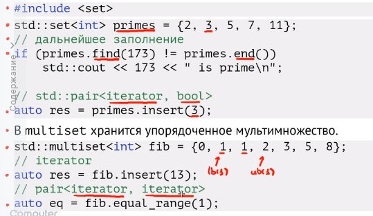
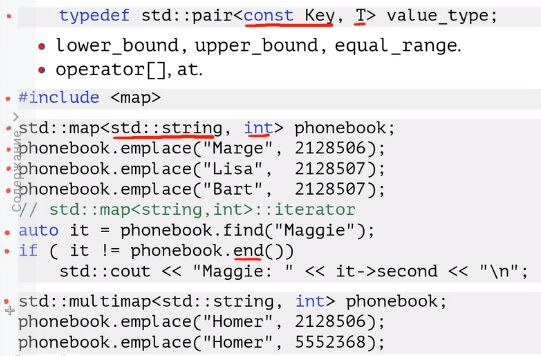
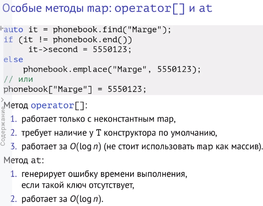
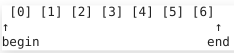
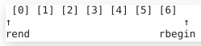

 Standard 
Library
* Особенности namespace std
>  не помещайте свой код в пространство имен std
* имена заголовочных файлов
>  обратите внимание на имена заголовочных файлов из стандартной библиотеки C:
используйте <cstring> вместо <string.h>
* аллокаторы определяют стратегии адресации, доступа к памяти, контсруирования объектов
* * раньше мб передать как параметр, но тогда вектора с разными аллокаторами не будут взаимодействовать. например, наш и стандартный
* * типа аллокатора зафиксирован как полиморфный. полиморфный аллокатор всегда один, но под катопом разные реализации

https://habr.com/ru/company/otus/blog/520502/

## Implementations
есть стандарт, он реализуется разными способами
* llvm libc++ (glang)
* libstdc++ (gcc)
* Microsoft STL

# Containers
## Последовательные 
обертка над стандартным массивом 

Sequence Containers: array, vector, deque, list, forward_list
* array<int, 3> x = ... //оберткаа над массивом, задаем размер статически, память непрерывна
* vector (noexcept конструкторы, операторы присваивания, память непрерывна)
* deque (двусторонняя очередь, доступ к элементам за константу (at, operator[]), учатски памяти разбросаны по чанкам. имеет какую-то карту чанков)
* list   
добавляем/удаляем за константу, итерироваться по вектору быстрее, чем по листу. почему?    
1. в кэш подгружается участок памяти, с которым работаем сейчас. для веткора это делается 1 раз. у листа память лежит в разных местах и нужно много раз загружать разные участки
2.  с векторами работать сложнее, нельзя оптимизировать
* forward_list - односвязный список

* string: template <CharT, Traits, Allocator> basic_string
## Ассоциативные
Associative
* имеют методы для работы с элементами ключом (find, count, erase) 
### 1.  Упорядоченные (Ordered)
* Основаны на дереве поиска, поэтому для типов хранимых в них нужно отношение порядка (должны сранивать на меньше)
* имеют методы для работы с ключом: 
* set, map, multiset, multimap
### set
* упорядоченное мноежство как двоичное сбалансированное дерево поиска, хранятся непосредственно в дереве => изменять значение нельзя
* insert вщозвращает пару из итератора на элемент и флага (был этот элемент добавлен сейчас впервые (1) или уже существовал ранее (0))
### multiset 
то же. что и set, но ключ может повторяться
* при insert всегда возвращает итератор на новый элемент
* lower_bound вернет итератор на первую единичку, upped_bound - следующему элементу, который следующий за последним вхождением единички. equal_range вернет два итератора (один как lower_bound, второй как upper)

### map
* задает отображение из множества ключей в множество значений, отсортированное по ключи. 
* основан на двоичном сбалансированном дереве поиска.
* Хранит пары из неизменяемого ключа и значения. Ключ, как и в set, мы изменять не можем
* lower_bound, upper_bound, equal_range

### mulpimap
так же хранит упорядоченное отображение, но имеет упорядоченные ключи

* оператор []   
* * если ключ есть - вернется ссылка на объект, иначе по ключу создаться объект (с помощью конструктора по умолчанию) и вернется ссылка на него => работает только с неконстантным мапом, имеющим конструктор по умолчанию  
вызывет **find**, поэтому работает за логарифмическое время => лучше работать через итератор
* * метод at - если записи по ключу нет - генерируется ошибка времени выполнения (как у массива)


### 2.  Непорядоченные (unrdered)
* Unordered: unordered_set, unordered_map, ...​
> работает на хэш-таблицах. считаем для ключа хэш, в зависимости от него определяем бакет, в который запишем объект (остаток от деления на количество бакетов, все бакеты хранятся в векторе) и заносим туда (каждый бакет внутри создан в виде списка)
## Адапторы
Адапторы содержат под капотом какие-то другие структуры контейнеров, к которым выставляются определенные требования 
Adaptors: stack, queue, priority_queue
# Views: span
не владеет своей памятью: указатель на место в памяти и смещение. пример: string_view. используем его, чтобы не копировать данные. при этом нужно обеспечить сохранность данных (что владелец его точно где-то храниться)

### std::vector 

* имеет специализацию для 
```c++
std::vector<bool>
std::vector<bool> vs{true, true, false};
for (auto& item : vs) {} // compile-time error
```
над возвращается обертка над булом, каторая является rvalue, т.е.  его нельзя присвоить в lvalue. Чтобы починить можно добавить const (продлит всермя жизни объекта) или второй &. Но если меняем эту штуку, то меняем и значения в векторе.

а если оставить только auto? вроде не сможем другие объекты итеррировать

* используем reserve если известна оценка размера сверху
```c++
std::vector<Box> boxes;
boxes.reserve(100);
assert(boxes.size() == 0);
assert(boxes.capacity() == 100);
```
* emplace_back vs push_back
emplace_back - вариадик темплейт, чета там делает нужно вспомнить
* operator[] vs at

std::unordered_*
**load_factor** (размер контейнера поделить на количество бакетов), **max_load_factor** (число, можем задать произвольно, если load_factor его превысит - делаем рехэш), rehashing
если возможно оценить количество ключей, то можно задать
количество bucket-ов, чтобы избежать лишнего
рехеширования

## structured_binding
iteration through maps

```c++
std::map<int, int> m{{1,2},{2,3},{3, 4}};
for (const auto& [key, value] : m) { // structured bindi
std::cout << key << " " << value << std::endl;
}
```
https://en.cppreference.com/w/cpp/language/structured_binding

# Iterators
* Все рассмотренные контейнеры имеют итераторы:
begin(),/end(), cbegin()/cend()

через константный итератор нельзя менять контейнер. begin(),/end() могут быть константными или нет. 

cbegin()/cend() всегда константные 
* Итератор — объект, связанный с некоторой позицией в
контейнере
* В зависимости от **категории** задает набор операций над собой. Во многом зависит от контейнера.
* С точки зрения интерфейса похож на указатель:
```c++
std::vector v{1,2,3,4,5}; // CTAD ()-  тип вектора не указан явно, а выводится сам
for (auto it = v.begin(); it != v.end(); ++it) {
std::cout << *it << " ";
}
```
* Используя итератор и операцию инкремента можно обойти все
элементы контейнера. 
* можно думать как о штуке, которая стоит между элементами объекта. begin смотрит вправо, rbegin влево



## Категории
output - разыменовать, записать, инкремент 

intput - разыменовать,  считать, инкремент 

random access -  по индексу за константу обращаемся - дека 

категория задается в iterator_traits category (если нужно) и другие алиасы на типы, т.е. наедляет интератор свойствами
## реверсивные
у реверсивного итрератора можно взять base - обычный итератор, который стоял бы на том же месте (но смотрел в другую сторону)

# Адапторы
move_iterator - при разыменовывании возвращает не ссылку на объекта, а его сам
```c++
std::vector<std::vector<int>> matrix {{1,2,3},{4,5,6
std::vector<std::vector<int>> m2(
std::make_move_iterator(matrix.begin()),
std::make_move_iterator(matrix.end()));
assert(matrix[0].empty());
```

back_inserter_iterator - output итератор -> 1 раз разыменовываем 

10 вектор заполнится двойками: в цикле 10 раз разыменовываем итератор, делаем пушбэк, итерируемся
```c++
std::vector<int> v;
std::fill_n(std::back_inserter(v), 10, 2);
assert(v.size() == 10);
assert(v[0] == 2);
```
### istream_iterator & ostream_iterator
```c++ 
std::istringstream str("1 2 3 4 5");
std::partial_sum(std::istream_iterator<int>(str), //начало
std::istream_iterator<int>(), //конец, будет равен ему
std::ostream_iterator<int>(std::cout, ",")) //вывод с делиметором 
```
## Invalidation
Иногда возникает необходимость сохранять сами итераторы, но
в некоторых случая они могут инвалидироваться при
модификации контейнера:
https://en.cppreference.com/w/cpp/container#Iterator_invalidation

при реаллокации веткора итераторы, сохраненные ранее для него будут поломаны

для листа все ок

для деки нужно глядеть

# Algorithms
Алгоритмы работают с контейнерами используя итераторы
std::vector vs{1,2,3};
std::copy(vs.rbegin(), vs.rend(),
std::ostream_iterator<int>(std::cout, "_")
Алгоритмы используют категорию итератора, чтобы выбрать
наиболее эффективную реализацию
Если контейнер предлагает аналог алгоритма в качестве метода,
то лучше использовать его (он знает об имплементации чего-то там) (std::lower_bound vs
std::set<T>::lower_bound)

# remove-erase idiom
```c++
std::vector vs{1,2,3,4,5};
auto it = std::remove(vs.begin(), vs.end(), 3);
std::cout << "vs.size: " << vs.size() << "\n";
vs.erase(it, vs.end());
std::cout << "vs.size: " << vs.size()<< "\n";
std::vector vs{1,2,3,4,5};
vs.erase(std::remove(vs.begin(), vs.end(), 3), vs.end());
```
если хотим удалить элементы из вектора в произвольном месте, а остальное сдвинуть

remove смещает объекты, не равные 3

после этого вектор все еще имеет размер 5 и вид 1,2,4,5,5, итератор it между пятерками

erase удаляет хвостик и изменяет размер

# <memory>
```c++
class Person {
public:
Person() = default;
friend void makeFriendship(
const std::shared_ptr<Person>& p1,
const std::shared_ptr<Person>& p2)
{
p1->friends.push_back(p2);
p2->friends.push_back(p1);
}
~Person() { std::cout << "dtor\n"; }
private:
std::vector<std::shared_ptr<Person>> friends;
};
int main() {
auto p1 = std::make_shared<Person>();
auto p2 = std::make_shared<Person>();
makeFriendship(p1, p2);
//уничтожаем  р2, р1. объекты где-то там ссылаются друг на друга, циклическая зависимость
}
```
Как решать? weak ptr

# <chrono>
Main concepts
* **clock** дает число, начиная с некоторого периода. зависит от реализации
* **time point** точка во времени, конкретное число начиная с эпохи
* **time duration** продолжительность (сколько времени прошло)

## Use case
```c++
auto start = std::chrono::steady_clock::now();
payload();
auto end = std::chrono::steady_clock::now();
std::cout << "Elapsed time: " << (end - start).count
```
там бы делать duration cast и выбирать единицу измреения 
steady_clock - монотонные часы, end всегда меньше start 


################################################
# Практика 
Хотим вернуть указатель в обертке на сам объект (т.к. RAII)
```c++
struct Foo{
    
    smart_ptr method(){
        this; //его хотим вернуть
        return u_ptr(this);
        //будет удалено, когда мы его потеряем или выйдем за области видимости чего-то там
    }
}
...
Foo f; //это на стеке 
auto p = f.Method();
//delete f
//умный указатель попробуем сделать delete, хотя объект создан на стеке
...

Foo * f = new Method(); //это на стеке 
auto p = f->Method();

//теперь все ок, если не писать delete f (вместо нас его удалит  p)
...
shared_ptr: треубет конструктор копирования
struct Foo{
    
    smart_ptr method(){
        this; //его хотим вернуть
        return sh_ptr(this);
        //будет удалено, когда мы его потеряем или выйдем за области видимости чего-то там
    }
}
лучше так: если объект менеджерится shared_ptr - то и создавать его в sharedPTr
sh_p<Foo> f = sh_p(new Foo);
auto p1 = f.met();
auto p2 = f.met();
p1 = f; // тоже отработает, т.к. имеют 1 тип
тут все ок, будем идти и удалять пойнтеры. когда останется 1 - удалит освободить память единожды
```